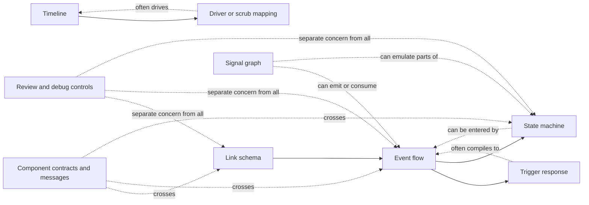

# Canonical Interaction Schema for an LLM-Readable UI Source Format

## Executive summary

The central finding is that mature interaction tools do **not** converge on one canonical interaction schema. They converge on a **small family of incompatible but composable paradigms**: owner-attached navigation links, event/case/effect flows, trigger/response micro-interactions, finite state machines, timeline/driver mappings, and patch-style signal graphs. Figma’s `Reaction` model is a node-owned trigger plus one-or-more actions; Sketch’s public API exposes a much narrower `Flow` object even though product docs now describe overlays, hover/press/toggle visibility, scrolling, and fixed elements; Flinto explicitly splits screen-to-screen links from group-owned behaviors; Principle splits artboard events from intra-artboard drivers and component messages; Rive and dotLottie formalize state machines; Origami makes interaction an explicit graph of typed patches and ports. That diversity is structural, not incidental. citeturn11view1turn11view2turn11view0turn13view0turn16view0turn14search1turn23view0turn25view1turn27view0turn28view0turn40view0turn40view1turn42view0turn30view0turn31view1

That means the right target is **not** a monolithic “universal interaction IR” that flattens everything into `actions[]`, nor a single global table of behavior. The safer design is a **federated canonical schema**: a small set of shared primitives—owner/subject/target references, triggers, guards, effects, state variables, messages, transitions—and then **model-specific sub-schemas** for `link`, `event_flow`, `trigger_response`, `validation`, `message_handler`, `state_machine`, `timeline`, `driver`, and `signal_graph`. Most concrete interaction definitions should stay attached to the owning `frame`, `layer`, `component instance`, or animation object; the top-level `interactions` registry should hold only shared definitions, shared variables/messages/contracts, reusable machines/timelines/graphs, and review/debug presets. citeturn11view2turn16view0turn23view0turn24view0turn27view0turn30view2turn5search0turn6view0turn5search2

The user’s taxonomy is directionally right, but incomplete in two important ways. First, some tools are **hybrids** rather than clean members of one bucket: Flinto is both link-based and stateful/driver-like; Principle is event-based, driver-based, and message-based at once; advanced Figma prototyping is no longer just “link-based” because actions can be conditional and can update variables. Second, **component contracts/messages** and **review/debug controls** are better treated as **orthogonal dimensions**, not paradigms. Principle component messages, Framer event variables, Sketch symbol interaction overrides, and Penpot plugin/API interaction attachment all point toward a dedicated contract layer. Meanwhile Sketch’s prototype sharing controls and Penpot’s View/Comments/Inspect separation show that reviewer/debug affordances should not be represented as canonical interaction behavior. citeturn11view0turn11view2turn27view0turn28view2turn5search2turn14search3turn17search3turn4search5turn6view0

The most important design decision, therefore, is this: **unify references and semantics, not all authored shapes**. Keep `link` as a first-class shorthand because donors expose it directly and because it is far lighter-weight than a compiled event graph. Keep `state_machine`, `timeline`, and `signal_graph` as dedicated structures because forcing them into `event_flow` destroys fidelity. Allow variables, timelines, machines, and graphs both **locally** on owners and **globally** in a shared registry, with a simple rule: local by default, registry only when reusable or cross-owner. Distinguish a **transition** from a **timeline** by scope: a transition is an edge-local interpolation between discrete states, whereas a timeline is an authored time track that can be played or scrubbed independently. Represent signal/dataflow as an explicit optional graph model, not as the baseline for all interactions. citeturn13view0turn26view2turn28view0turn30view0turn35view0turn40view1turn42view0

## Evidence base and donor comparison

I use the requested evidence labels as follows: **public_spec**, **official_api**, **plugin_api**, **runtime_api**, **official_docs**, **source_available**, **generated_artifact**, **sample_artifact_probe**, **inferred_behavior**, and **speculative**. In this pass, the strongest evidence came from public specs and official/plugin/runtime documentation. I did **not** rely on private reverse-engineered native file formats. Where public schema fields were unavailable, I report the gap rather than inventing fields.

### Donor comparison table

| Donor | Strongest retrieved evidence | What owns interaction behavior | Primary paradigm in retrieved evidence | Confidence | Mapping lossiness | Evidence |
|---|---|---|---|---|---|---|
| Figma | `Reaction`, `Trigger`, `Action`, `Transition`, node `reactions`, variables docs | Scene node / component / instance node | Link + event flow + variable/conditional actions | High for plugin surface; medium overall | Low to medium | Plugin API exposes node-owned `reactions: ReadonlyArray<Reaction>`, with `Reaction = { trigger, actions[] }`; `Action` includes navigation, URL, media, variable, variable mode, and conditional branches; `Trigger` includes click, hover, press, drag, timeout, mouse, keyboard, and media triggers. citeturn11view1turn11view2turn11view0turn12view0turn13view0turn11view3 |
| Sketch | `Flow` API + official prototyping docs | Layer / hotspot / symbol source / frame | Link model, with newer overlays/visibility/scroll docs | Medium | Medium | Public API exposes `layer.flow` with target/back/animation; official docs add overlays, hover/press/toggle visibility, scrolling, fixed elements, start points, maintain scroll position, and symbol interaction overrides. citeturn16view0turn14search1turn14search2turn14search3turn14search4turn14search5turn14search6 |
| Flinto | Learn docs + official blog/docs | Screen links; group-owned behaviors | Link + local behavior states + scroll/timer-driven transitions | Medium | Medium | Links connect screens and can have multiple gestures; behaviors attach to groups, consist of states and links between states; scroll gestures and timer links drive state changes; transitions are edited separately in a Transition Designer. citeturn24view0turn23view0turn24view2turn25view0turn25view1turn25view2turn26view2turn22search0turn23view1turn23view2 |
| ProtoPie | No high-confidence schema artifact retrieved in this pass | Gap | Likely trigger/response, but not validated here | Low | High | Public schema/API/source proof was not established in the retrieved corpus for this report. |
| Axure RP | No high-confidence schema/API/artifact proof retrieved in this pass | Gap | Likely event/case/action, but not validated here | Low | High | Public schema/API/source proof was not established in the retrieved corpus for this report. |
| Rive | Editor docs + runtime docs + source-available runtime | Artboard state machine + data binding/view model | State machine with runtime-bound inputs/data | Medium-high | Low to medium | Editor docs define graph/states/transitions/inputs/layers; runtime docs emphasize indirect control through data binding and limited direct state observation; source code exposes `StateMachineInput` with named boolean/number/trigger values. citeturn40view0turn40view1turn40view2turn39search7 |
| dotLottie | Public formal v2.0 spec | State machine file inside archive | Explicit public state machine JSON | Very high | Low | Public spec defines archive structure, manifest `initial`, `stateMachines`, and full state machine JSON with states, transitions, guards, interactions, actions, and inputs. citeturn42view1turn42view0turn43view0turn43view1turn43view2turn43view3turn43view4turn43view5 |
| Principle | Official docs | Layer/artboard/component | Event flow + driver/timeline + component messages | Medium-high | Medium | Principle documents artboard events, built-in continuous interactions, drivers, component-local events, parent/component messages, touch routing, and destination-artboard animation storage. citeturn27view0turn28view0turn28view1turn28view2turn27view1 |
| Origami Studio | Official docs | Patch graph; patches reference layers | Signal/dataflow graph with pulses and state patches | High | Medium | Patches are the building blocks; the `Interaction` patch exposes typed outputs; `Option Switch` models multi-state selection; variables, components, and WebSocket patches make dataflow and messaging first-class. citeturn30view0turn31view1turn32search0turn35view0turn35view2turn30view2turn30view3 |
| Penpot | Official prototyping docs + plugin FAQ | Board / shape / group | Link/event-action with flows/overlays | Medium | Medium | Docs expose trigger/action/animation/flow concepts and actions such as navigate/open overlay/toggle overlay/close overlay/previous screen/open URL; plugin FAQ confirms `createFlow`, `addInteraction`, and `removeInteraction` for frames, shapes, and groups. citeturn5search0turn6view0turn4search5 |
| Framer | Official help docs | Component boundary / canvas interaction | Component event contract layered over actions | Low to medium | Medium to high | Official help says event variables let nested component actions trigger changes in a parent or on the canvas, and Framer often auto-generates such event variables for nested interactions. citeturn5search2 |
| UXPin | Not included as a primary donor here | Gap | Not established | Low | High | UXPin was not materially useful in this pass because high-confidence public schema evidence was not retrieved. |

### Schema evidence matrix by donor

#### Figma

| Field group | Retrieved evidence | Evidence level | Confidence |
|---|---|---|---|
| Core objects | `Reaction`, `Trigger`, `Action`, `Transition`, `Variable` | plugin_api | High |
| Ownership | `reactions` lives on many scene node types, including frames, components, instances, groups, shapes, and text | plugin_api | High |
| Key enums | Navigation: `NAVIGATE`, `SWAP`, `OVERLAY`, `SCROLL_TO`, `CHANGE_TO`; triggers include click/hover/press/drag/timeout/mouse/keyboard/media; transitions include dissolve, smart animate, scroll animate, move/push/slide types | plugin_api | High |
| Controls/guards | `CONDITIONAL` action with `conditionalBlocks`; variable actions | plugin_api | Medium-high |
| State/variables | Variables have ids, collection membership, types, values per mode, and can participate in prototyping actions | plugin_api | High |
| Known gaps | Retrieved evidence did not establish a full public REST/file-node interaction schema; strongest proof is Plugin API, not file-format spec | official_api gap | Medium |

Figma is the clearest example of why “prototype links” are no longer enough as an abstraction. Its public plugin surface already models an owner-attached reaction list, a trigger taxonomy broader than clicks, multiple actions per trigger, variable writes, variable mode switches, and conditional branches. That makes Figma closer to **event_flow with shorthand navigation** than to a pure link schema. citeturn11view1turn11view2turn11view0turn12view0turn13view0turn11view3

#### Sketch

| Field group | Retrieved evidence | Evidence level | Confidence |
|---|---|---|---|
| Core objects | `Flow` with `target`, `targetId`, `animationType`, `BackTarget` | official_api | High |
| Ownership | `flow` is associated with layers such as text and symbol instances; prototyping docs also describe hotspots, frames, and symbol-source interactions | official_api + official_docs | Medium-high |
| Key enums | `none`, `slideFromLeft`, `slideFromRight`, `slideFromBottom`, `slideFromTop` in API | official_api | High |
| Interaction docs beyond API | overlays, hover/press/toggle visibility, scrolling frames/areas, fixed elements, start points, maintain scroll position | official_docs | High |
| Component contracts | symbol-source interactions propagate to instances and can be overridden per instance | official_docs | Medium-high |
| Known gaps | Public API surface is narrower than product prototyping docs; retrieved API did not expose structured overlay/visibility/scroll objects | official_api gap | High |

Sketch is important because it demonstrates a **documentation/API split**. The public API still presents a compact link object, while the product docs describe a richer interaction system with overlays, visibility triggers, scrolling areas, fixed elements, and symbol overrides. A canonical local schema should therefore avoid equating “public plugin API surface” with “full interaction model.” citeturn16view0turn14search1turn14search2turn14search3turn14search4turn14search5turn14search6

#### Flinto

| Field group | Retrieved evidence | Evidence level | Confidence |
|---|---|---|---|
| Core objects | screens, links, gestures, transitions, behaviors, behavior states | official_docs | Medium |
| Ownership | links connect screens; behaviors attach to groups and affect layers within | official_docs | High |
| Inputs/triggers | tap and other gestures on links; button press/hover; scroll gestures; timer links | official_docs | Medium-high |
| State representation | behavior states with initial locked state and configurable default state | official_docs | High |
| Transitions | separate Transition Designer for two-screen transitions | official_docs | High |
| Known gaps | No public stable file schema or API object model retrieved | gap | High |

Flinto is best understood as a **dual model**: screen-to-screen navigation links for macro flow, and group-owned stateful behaviors for micro-interaction. Scroll gestures and timer links make the local behavior system partly driver-like and partly state-machine-like, but still authored as links between states rather than as a global machine graph. citeturn24view0turn23view0turn24view2turn25view0turn25view1turn25view2turn26view2turn23view1turn23view2

#### ProtoPie

No high-confidence public schema, API object model, runtime object model, or public source-format proof was retrieved in this pass. In the proposed mapping table below, ProtoPie is therefore treated as a **low-confidence donor** whose value is mainly to justify keeping a distinct `trigger_response` surface form rather than forcing everything into `event_flow`.

#### Axure RP

No high-confidence official schema/API/runtime/generated-artifact evidence was retrieved in this pass. Because the report cannot prove field names or object ownership from authoritative sources here, Axure is treated as a **gap donor** rather than a schema proof donor in this version of the report.

#### Rive

| Field group | Retrieved evidence | Evidence level | Confidence |
|---|---|---|---|
| Core objects | artboard, state machine, states, transitions, inputs, layers | official_docs | High |
| Ownership | state machines are owned by artboards; default state machine per artboard | official_docs + runtime_api | High |
| Runtime contract | limited direct state inspection/modification; runtime control through data binding/view model or legacy inputs | runtime_api + official_docs | High |
| Input types | source-available runtime shows named number/boolean/trigger inputs with `value` and `fire()` | source_available | High |
| Lifecycle semantics | playing/paused/stopped/settled behavior documented | runtime_api | High |
| Known gaps | no public formal `.riv` file schema retrieved; editor-level serialized fields remain opaque | gap | Medium |

Rive argues strongly for separating **state logic** from **runtime data contract**. The editor docs now explicitly mark legacy inputs as deprecated in favor of data binding and view models, while runtime docs state that direct state manipulation is intentionally limited to preserve designer freedom. The canonical schema should copy that idea: expose machine inputs and bindings as contract surfaces, but do not treat internal machine state as a broad mutable public table. citeturn40view0turn40view1turn40view2turn39search7

#### dotLottie

| Field group | Retrieved evidence | Evidence level | Confidence |
|---|---|---|---|
| Core objects | manifest `initial`, state machine JSON, states, transitions, interactions, inputs | public_spec | Very high |
| Ownership | state machine files inside archive; one initial animation or state machine in manifest | public_spec | Very high |
| State types | `PlaybackState`, `GlobalState` | public_spec | High |
| Guards | numeric, string, boolean guards with typed comparison enums | public_spec | High |
| Actions | increment, decrement, toggle, set boolean/string/numeric, fire, reset, theme actions | public_spec | High |
| Interactions | pointer up/down/enter/move with optional layer scoping and action lists | public_spec | High |
| Inputs | boolean/string/event explicitly retrieved; numeric input is implied elsewhere in spec and by guard/action shapes | public_spec + inferred_behavior | Medium-high |

dotLottie is the strongest public proof donor because it publishes a formal JSON schema for interactive state machines. It is also the cleanest example of why a canonical design should keep `state_machine` as a specialized model, not a compiled view of generic events. The spec’s `GlobalState`, typed guards, typed actions, explicit input objects, and pointer interactions are all first-class state-machine concepts. citeturn42view1turn42view0turn43view0turn43view1turn43view2turn43view3turn43view4turn43view5

#### Principle

| Field group | Retrieved evidence | Evidence level | Confidence |
|---|---|---|---|
| Core objects | artboards, events, animate panel keyframes/curves, drivers, components, messages | official_docs | High |
| Ownership | events on layers/artboards; drivers on current artboard; components contain independent artboards/events/animations | official_docs | High |
| Trigger taxonomy | tap, drag begin/end, scroll begins/released/ended, touch down/up, long press, hover inside/outside, auto | official_docs | High |
| Driver model | driver sources from draggable/scrollable/optional properties; driven properties via keyframes | official_docs | High |
| Message contracts | components and parents communicate via named message events | official_docs | High |
| Lifecycle semantics | transition animation settings stored on destination artboard and shared by transitions to it | official_docs | High |

Principle is not just a timeline tool. It combines owner-attached events, artboard transitions, intra-artboard driver mappings, and component message contracts. That makes it especially useful for a canonical schema because it proves that **driver logic** and **message contracts** deserve explicit structures, not awkward encoding as navigation actions. citeturn27view0turn28view0turn28view1turn28view2turn27view1

#### Origami Studio

| Field group | Retrieved evidence | Evidence level | Confidence |
|---|---|---|---|
| Core objects | patches, patch ports, patch components, layer components | official_docs | High |
| Ownership | behavior lives in patch graph; layer interaction enters graph through target-specific patches | official_docs | High |
| Trigger/input | `Interaction` patch provides `Down`, `Tap`, `Position`, `Force` | official_docs | High |
| State representation | `Option Switch` models multi-state selection; pulses and waits drive time-based changes | official_docs | High |
| Variables/messages | Variable broadcaster/receiver; global cascading variables; WebSocket connection/send/receive | official_docs | High |
| Known gaps | no public full file serialization spec retrieved | gap | Medium |

Origami is the strongest warning against over-unification. Its primary authored form is not “events on owners,” but a patch graph of typed nodes, pulses, variables, waits, loops, and network/message patches. A canonical schema can support this, but only by making `signal_graph` optional and explicit instead of forcing all common interactions into graph form. citeturn30view0turn31view1turn32search0turn35view0turn35view2turn30view2turn30view3

#### Penpot

| Field group | Retrieved evidence | Evidence level | Confidence |
|---|---|---|---|
| Core objects | flows, interactions, triggers, actions, animations | official_docs + plugin_api pointer | Medium |
| Ownership | boards, shapes, and groups can own flows/interactions | official_docs + plugin_api pointer | Medium-high |
| Actions | navigate to, open overlay, toggle overlay, close overlay, previous screen, open URL | official_docs | High |
| Preview/review separation | View mode exposes interaction playback, comments mode, inspect mode | official_docs | High |
| Known gaps | retrieved plugin type docs did not render the actual `Interaction`/`Flow` fields, so exact field taxonomy remains incomplete | gap | High |

Penpot is useful less for depth than for structure: it cleanly distinguishes interaction concepts—trigger, action, animation, flow—and exposes plugin methods to attach these to owners such as frames, shapes, and groups. It also offers a good precedent for separating prototype playback from comments/inspect review modes. citeturn5search0turn6view0turn4search5

#### Framer

| Field group | Retrieved evidence | Evidence level | Confidence |
|---|---|---|---|
| Core objects | event variables | official_docs | Medium |
| Ownership | nested component interactions can surface as events to parents or the canvas | official_docs | Medium |
| Message/contract semantics | events may be auto-generated for nested interactions and can be manually defined for more control | official_docs | Medium |
| Known gaps | no public source schema/API/runtime object model retrieved for broader interactions | gap | High |

Framer’s most useful donor contribution in this pass is the idea that component-local interactions should be able to **emit named events across component boundaries** without flattening component internals into the document root. That directly supports a component interaction contract layer. citeturn5search2

#### UXPin

No evidence-rich public schema source was retrieved in this pass, and it does not materially change the recommended canonical architecture beyond patterns already captured by event/action, validation, and message-contract donors.

## Taxonomy of interaction schema paradigms

The original hypothesis is broadly correct, but it is somewhat too tool-centric and slightly too flat. A better taxonomy distinguishes **core paradigms** from **cross-cutting dimensions**.

### Corrected taxonomy



The improved taxonomy is:

| Paradigm | Best donors in retrieved evidence | Why it is distinct |
|---|---|---|
| Link schema | Sketch `Flow`, Figma `NODE` navigation actions, Penpot basic prototype flows | Owner-attached navigation to another frame/screen/overlay with compact motion options |
| Event flow | Figma reactions, Principle events, Penpot trigger/action model | Triggered behavior with optional cases/guards and ordered effects |
| Trigger response | Flinto behaviors; low-confidence ProtoPie bucket | Authoring idiom centered on “when trigger then responses,” often preserving sequencing, delays, and micro-interaction semantics |
| State machine | Rive, dotLottie, Axure-style dynamic-state models conceptually | Explicit states, transitions, guards, entry/exit effects, often with a runtime input contract |
| Timeline | Principle animate panel, Flinto transition designer | Time-authored interpolation/keyframes independent of a single event edge |
| Driver | Principle drivers, Flinto scroll gestures, scroll-bound animation idioms | Continuous input mapped to properties or timeline progress |
| Signal graph | Origami | Typed node/port graph with pulses, state patches, variables, and operators |
| Component contract/message | Principle messages, Framer event variables, Sketch symbol overrides | Cross-cutting, not a standalone behavior paradigm |
| Review/debug control | Sketch share toggles, Penpot view/comments/inspect | Presentation/testing concern, not canonical interaction behavior |

This corrected taxonomy matters because the canonical schema should preserve **separation between paradigms** where that separation is semantically useful. The mistake to avoid is treating everything as event/action because that destroys state machines, drivers, and graphs; the opposite mistake is treating everything as a graph because that burdens simple links and validations with needless machinery. citeturn16view0turn11view0turn11view1turn5search0turn23view0turn25view1turn40view0turn40view1turn42view0turn27view0turn28view0turn30view0turn35view0turn17search3turn4search5

## Proposed canonical schema architecture

The recommended architecture is **owner-first, registry-second, multi-paradigm by design**.

### Architectural principles

First, attach most concrete interactions to the thing that owns them: a frame owns screen-level flow and screen-local machines; a layer owns hotspot behavior, validation, and micro-interactions; a component instance owns its bindings to a component contract; an animation or state-machine object owns its internal states and transitions. This follows the object ownership shape visible in Figma nodes, Sketch layers, Flinto groups, Principle layers/components, and Penpot frames/shapes/groups. citeturn11view2turn16view0turn23view0turn28view2turn5search0turn6view0

Second, keep a top-level `interactions` registry, but do **not** turn it into a giant table of every behavior in the file. It should store only shared or reusable artifacts: shared variables, message channels, component contracts, reusable transitions, timelines, drivers, state machines, signal graphs, and review/debug presets. That pattern best matches the difference between local owner behavior and reusable heavy assets seen in Flinto reusable behaviors/transitions, Principle shared component/message structures, Origami components/variables, and Rive/dotLottie machines. citeturn23view1turn28view2turn30view2turn35view0turn40view1turn42view0

Third, unify only the **primitives** that genuinely recur across donors: owner refs, target refs, triggers, guards, effects, transitions, variables, messages, bindings. Do **not** force all donors into one normalized core shape. The canonical schema should look more like a package of interoperable sub-schemas than a single flat AST. That is the simplest model that can still faithfully represent Figma reactions, Sketch flows, Flinto behavior states, Principle drivers, Rive machines, dotLottie specs, and Origami graphs. citeturn11view1turn16view0turn24view2turn28view0turn40view0turn42view0turn30view0

### Recommended top-level `interactions` structure

```yaml
project:
  interactions:
    variables:        # shared interaction/runtime state, not design tokens
      byId: {}
    messages:         # named channels and payload contracts
      byId: {}
    contracts:        # component interaction contracts
      byId: {}
    transitions:      # reusable transition presets only
      byId: {}
    eventFlows:       # reusable event/case/effect flows
      byId: {}
    validations:      # reusable validation rule sets
      byId: {}
    handlers:         # reusable message handlers
      byId: {}
    timelines:        # reusable authored keyframe sequences
      byId: {}
    drivers:          # reusable input-to-property or input-to-timeline mappings
      byId: {}
    stateMachines:    # reusable explicit machine definitions
      byId: {}
    signalGraphs:     # reusable patch/dataflow graphs
      byId: {}
    reviewProfiles:   # non-canonical playback/debug presets
      byId: {}
```

This is intentionally a **registry of sharables**, not an all-behavior index. If an interaction is unique to one layer, keep it on that layer. If a timeline is used by four components, move it here and reference it by id.

### What belongs directly on `document.frames[]`

A frame should directly own:

- `prototype`: start-point and screen-level playback metadata, such as whether the frame is a flow start, whether it behaves as an overlay, and viewport/scroll metadata.
- `interactions[]`: screen-level links, lifecycle handlers, and frame-wide event flows.
- `behavior`: optional local variables, state machines, timelines, drivers, and signal graphs that are private to that frame.
- `messageHandlers[]`: frame-level receives, for cases like “when message X arrives, open overlay Y.”

This is justified by Sketch start points/overlays/scrolling frames, Penpot flows/boards, Principle artboard events, and Rive artboard-owned state machines. citeturn14search1turn14search2turn14search4turn5search0turn27view0turn40view1

### What belongs directly on `document.frames[].layers[]`

A layer should directly own:

- `interactions[]`: click/hover/press/drag/keyboard/media/timer-triggered local behaviors.
- `validation[]`: because form rules are usually field- or submit-control-scoped.
- `componentBinding`: if the layer is a component instance, bind its contract here.
- `behavior`: optional local variables, local machines, local timelines, local drivers, or a local signal graph when the interaction is truly private to that layer.
- `touchPolicy` or `inputPolicy`: optional metadata such as pass-through/capture semantics when needed.

This matches Figma node-owned reactions, Sketch layer flows and visibility settings, Flinto group behaviors, Principle layer events/touch routing, and Penpot shape/group interactions. citeturn11view2turn14search3turn14search5turn23view0turn27view0turn5search0turn6view0

### What belongs in `resources`

Interaction contracts for reusable components belong with the component resources, not in frame/layer instances:

```yaml
resources:
  components:
    - id: ButtonPrimary
      interactionContract:
        events: [...]
        commands: [...]
        stateProps: [...]
```

Instances then bind to that contract via `layer.componentBinding`. This mirrors Principle component messages, Framer event variables, and Sketch symbol-source/instance interaction relationships. citeturn28view2turn5search2turn14search3

### Why `link` should stay first-class

`link` should be a first-class shorthand, **not only a compiled form** of `event_flow`.

The reason is practical and structural: Figma, Sketch, and Penpot all expose direct owner-attached navigation relationships as their smallest interaction unit. Modeling every simple screen jump as a verbose trigger/case/effect program makes the common case heavier and less legible. The schema can still define a normalization path from `link` to `event_flow`, but authoring and storage should preserve `link` as a lightweight distinct kind. citeturn11view0turn16view0turn5search0

### Why state machines, timelines, drivers, and variables should be local or global

They should be allowed **both locally and globally**:

- **Local** when behavior is encapsulated by one owner.
- **Global/registry** when behavior is reused, referenced across owners, or needs document-level coordination.

Principle components and drivers, Flinto reusable behaviors, Origami global variables/components, and Rive/dotLottie machine reuse all support this dual placement. A registry-only approach is too abstract; local-only blocks reuse. citeturn23view1turn28view0turn28view2turn35view0turn30view2turn40view1turn42view0

### Transition versus timeline versus driver

A canonical distinction that actually holds across donors is:

- **Transition**: an edge-local interpolation that happens **because** a discrete state/link/event change occurred.
- **Timeline**: an authored temporal sequence with tracks/keyframes/markers that can be played, paused, looped, or scrubbed.
- **Driver**: a continuous mapping from an input domain—drag distance, scroll position, sensor value, variable—to property values or timeline progress.

This matches Figma’s transition objects, Flinto’s separate Transition Designer plus scroll-state control, Principle’s animate panel plus drivers, and Rive/dotLottie state changes versus playback control. citeturn13view0turn26view2turn25view1turn27view0turn28view0turn40view1turn42view2

### Signal graph representation without overloading the common model

`signal_graph` should be an explicitly separate model with a node/port/edge structure. It should not be the common denominator.

That is the only way to preserve Origami-style pulses, variables, waits, and graph-local operators without forcing simple Figma/Sketch/Penpot-style interactions into a graph. The common schema should only provide graph **bindings** to owners, variables, messages, and effect sinks. citeturn30view0turn31view1turn35view0turn35view2

### Reviewer and debug controls should be separate

Reviewer/debug controls belong under `project.interactions.reviewProfiles` or a sibling `review` namespace, not in canonical behavior objects. Sketch sharing controls can hide hotspots and UI chrome without changing the underlying prototype, and Penpot’s View mode separates interaction playback from comments and inspect. That separation should be preserved in the local schema. citeturn17search3turn4search5

## Local schema field tables and donor mappings

### Recommended common primitives

| Primitive | Recommended fields | Notes |
|---|---|---|
| `OwnerRef` | `type`, `id`, optional `path` | `type`: `frame`, `layer`, `component_instance`, `state_machine`, `timeline`, `signal_graph` |
| `TargetRef` | `type`, `id`, optional `subpath` | Allows frame/layer/component/machine/timeline targets |
| `Trigger` | `kind`, optional `source`, optional `params` | `kind` examples: `click`, `press_down`, `press_up`, `hover_enter`, `hover_leave`, `drag_start`, `drag_update`, `drag_end`, `scroll_start`, `scroll_update`, `scroll_end`, `timeout`, `key_down`, `focus`, `blur`, `media_end`, `message`, `state_enter`, `state_exit`, `animation_complete` |
| `Condition` | `all[]`, `any[]`, `not`, or atomic `op/left/right` | Keep this typed and bounded; do not embed arbitrary JS as the default |
| `VariableRef` | `scope`, `id` | `scope`: `local`, `shared`, `contract`, `runtime` |
| `MessageRef` | `channel`, optional `topic` | Supports cross-component and external transports |
| `Effect` | typed union | See model-specific structures below |
| `TransitionRef` | either inline transition or `ref` | Transition presets should be reusable |
| `Binding` | `from`, `to`, optional `transform` | Useful for drivers, contracts, and graph IO |

### Recommended model-specific structures

| Kind | Recommended shape | Why it exists as its own kind |
|---|---|---|
| `link` | `trigger`, `target`, `navigation`, `transition`, `historyPolicy`, `viewportPolicy` | Common case; maps directly from Figma/Sketch/Penpot |
| `event_flow` | `triggers[]`, `cases[]`, `elseEffects[]`, `consume`, `cancel` | General trigger/guard/effect flow |
| `trigger_response` | `trigger`, `responses[]`, optional `conditions`, `timing`, `repeatPolicy` | Preserves ProtoPie/Flinto-like authoring semantics |
| `validation` | `on`, `fields[]`, `rules[]`, `failureCases[]`, `successEffects[]` | Form logic is common and semantically special |
| `message_handler` | `message`, `cases[]`, `effects[]` | Cross-component or external messages are not ordinary pointer events |
| `state_machine` | `inputs[]`, `variables[]`, `regions[]`, `globalTransitions[]`, `entry/exit effects` | Needed for Rive/dotLottie and panel/variant state models |
| `timeline` | `duration`, `tracks[]`, `markers[]`, `playback` | Needed for authored time sequences |
| `driver` | `source`, `bindings[]`, optional `clamp`, `extrapolate` | Needed for drag/scroll/sensor scrubbing |
| `signal_graph` | `nodes[]`, `edges[]`, `exposedInputs[]`, `exposedOutputs[]` | Needed for Origami-class graphs |

### Recommended core field table

| Field path | Type | Req | Allowed values or shape | Owner | Purpose | Donor evidence | Maps from donor fields | Known limitations |
|---|---|---:|---|---|---|---|---|---|
| `project.interactions.variables.byId` | map | optional | `VariableDef` | project | shared interaction/runtime vars | Rive, Figma, Origami, dotLottie | Figma variables; Rive view-model props; Origami variable broadcasters; dotLottie inputs | separate from design tokens |
| `project.interactions.messages.byId` | map | optional | `MessageDef` | project | shared message channels/contracts | Principle, Framer, Origami | Principle message events; Framer event variables; Origami WebSocket/data signals | external transport semantics remain open |
| `project.interactions.contracts.byId` | map | optional | `ContractDef` | project | reusable component interaction contracts | Principle, Framer, Sketch | component messages/events, symbol overrides | not all donors expose formal contracts |
| `project.interactions.transitions.byId` | map | optional | `TransitionPreset` | project | reusable motion presets | Figma, Sketch, Flinto | transition objects or named transitions | not a full animation timeline |
| `project.interactions.eventFlows.byId` | map | optional | `EventFlowDef` | project | reusable flow logic | Figma, Penpot, Principle | node reactions, frame events | registry only when reusable |
| `project.interactions.timelines.byId` | map | optional | `TimelineDef` | project | reusable keyframed sequences | Principle, Flinto | animate panel, transition designer | only when reused |
| `project.interactions.drivers.byId` | map | optional | `DriverDef` | project | reusable continuous mappings | Principle, Flinto | driver sources, scroll gestures | registry not needed for simple local use |
| `project.interactions.stateMachines.byId` | map | optional | `StateMachineDef` | project | reusable explicit state machines | Rive, dotLottie | artboard machines, state machine JSON | avoid universal use |
| `project.interactions.signalGraphs.byId` | map | optional | `SignalGraphDef` | project | reusable graphs/dataflow | Origami | patch components | heavy; use sparingly |
| `project.interactions.reviewProfiles.byId` | map | optional | `ReviewProfile` | project | reviewer/debug presets | Sketch, Penpot | preview/share toggles, inspect/comment modes | not canonical runtime behavior |
| `document.frames[].prototype` | object | optional | `start`, `overlay`, `viewport` | frame | screen-level playback metadata | Sketch, Penpot | start point, overlay frame, scroll frame | keep small |
| `document.frames[].interactions[]` | array | optional | `InteractionUnion` | frame | screen-wide flows and handlers | Sketch, Penpot, Principle | board links, artboard events | avoid stuffing every child behavior here |
| `document.frames[].behavior.variables[]` | array | optional | local `VariableDef` | frame | frame-scoped state | Rive, Origami | local machine vars, local graph vars | local override semantics needed |
| `document.frames[].behavior.stateMachines[]` | array | optional | local or `ref` | frame | frame-private machines | Rive, dotLottie, dynamic-panel-style mappings | artboard machine | may be overkill for simple screens |
| `document.frames[].behavior.timelines[]` | array | optional | local or `ref` | frame | frame-private timelines | Principle, Flinto | artboard animations | use only when owner-local |
| `document.frames[].behavior.drivers[]` | array | optional | local or `ref` | frame | scroll/drag/device drivers | Principle, Flinto | driver source mappings | continuous semantics only |
| `document.frames[].messageHandlers[]` | array | optional | `MessageHandlerDef` | frame | react to document/global messages | Principle, Framer, Origami | message listeners | ordering semantics open |
| `document.frames[].layers[].interactions[]` | array | optional | `InteractionUnion` | layer | hotspot/micro-interaction behavior | Figma, Sketch, Flinto, Penpot, Principle | node reactions, layer flows, behavior links | primary common field |
| `document.frames[].layers[].validation[]` | array | optional | `ValidationDef` | layer | field and submit validation | form-logic donors generally | submit/blur/input validation rules | no donor with rich public schema retrieved |
| `document.frames[].layers[].componentBinding` | object | optional | `contractRef`, `eventBindings`, `stateBindings` | layer instance | bind component contracts | Principle, Framer, Sketch | component messages, event variables, symbol overrides | relies on component resources |
| `resources.components[].interactionContract` | object | optional | `events`, `commands`, `stateProps` | component resource | reusable component IO contract | Principle, Framer, Sketch | emitted messages, accepted messages/overrides | not always explicitly authored in donor tools |
| `interaction.kind` | enum | required | `link`, `event_flow`, `trigger_response`, `validation`, `message_handler`, `state_machine`, `timeline`, `driver`, `signal_graph` | any interaction | dispatches sub-schema | all donors | paradigm classification | some kinds may compile to others |
| `interaction.owner` | `OwnerRef` | optional if owner-attached | — | interaction | explicit ownership when registry-held | all strong donors | node/layer/group/artboard ownership | redundant when inline |
| `transition` | object or `ref` | optional | type/easing/duration/direction | link/event/state transition | edge-local motion | Figma, Sketch, Flinto, Principle | transition settings | distinct from timelines |
| `effect[]` | array | optional | typed union | event_flow/handler/etc. | concrete state change or side effect | Figma, dotLottie, Penpot | navigate/open/set/fire/toggle/etc. | should stay typed, not stringly |

### Mapping table from donor tools into the proposed schema

| Donor | Best-fit canonical mapping | Where to attach | Lossy areas |
|---|---|---|---|
| Figma | `link` for simple node nav; `event_flow` for multi-action or conditional reactions; shared vars in `interactions.variables`; component/instance bindings as `componentBinding` | layer/frame node owners | some Figma-specific transition flags and variable-mode details need extensions |
| Sketch | `link` for `Flow`; frame `prototype.overlay/viewport`; layer `interactions[]` for visibility; `componentBinding` for symbol overrides | mostly layer/frame | public API/docs mismatch means some details are only doc-backed |
| Flinto | screen links as `link`; group behaviors as local `state_machine` or `trigger_response`; scroll gestures as `driver` | frame for screen flow; layer/group for behaviors | no public typed file schema; behavior reuse semantics may need registry refs |
| ProtoPie | likely `trigger_response` plus `variables`, `messages`, `drivers` | layer/component/frame | mapping remains speculative in this pass |
| Axure RP | likely `event_flow`; dynamic panels as local `state_machine`; form rules as `validation` | frame/layer/panel owner | mapping remains speculative in this pass |
| Rive | `state_machine` with contract inputs; shared or owner-local vars; optional `timeline` for named animations | animation/state-machine object under frame/layer behavior or registry | internal `.riv` serialization remains opaque |
| dotLottie | nearly direct `state_machine` import; pointer `interactions` become machine-owned interaction entries | registry or animation object | minor differences for theming and archive packaging |
| Principle | artboard events as `event_flow`/`link`; animate panel as `timeline`; drivers as `driver`; component messages as `contracts/messages` | frame/layer/component | shared-animation-on-destination semantics need explicit import rule |
| Origami | `signal_graph`; patch-local states as `variables`/`state_machine` if desired; WebSockets via `message_handler` or external adapter | owner-local graph or shared graph | exact patch library vocabulary need not be canonicalized |
| Penpot | basic doc model maps to `link`, `event_flow`, frame `prototype`, overlay metadata | frame/layer | typed plugin field details incomplete in retrieved docs |
| Framer | component event vars map to `contracts/messages`; overlay/show actions to `event_flow` or `link` | component resource + instance binding | broader source schema not public in retrieved corpus |
| UXPin | likely `event_flow` + `validation` + `componentBinding` | depends on artifact | not evidenced here |

## Edge cases, risks, and YAML-like examples

### Edge cases

Nested components should inherit the local-owner rule: interactions inside a component stay internal unless the component contract explicitly exposes an event, command, or state property. This is exactly what Principle message events and Framer event variables are pointing toward. Without that rule, imported component internals will leak into document-global event tables. citeturn28view2turn5search2

Component variants should not be modeled as ad hoc navigation. They are better treated as **component state properties** or local state-machine states. Figma’s `CHANGE_TO` navigation type and Sketch symbol interaction overrides both suggest that the canonical model should support `effect.set_component_state` or `effect.change_variant` instead of only `navigate`. citeturn11view0turn14search3

Dynamic panel states are conceptually a local state machine, not a magic panel type. Even without a validated Axure public schema in this pass, the right canonical abstraction is still a layer-owned machine or state set with named states and owner-local transitions. That keeps the concept portable to component variants, Flinto behavior states, and dotLottie/Rive machines.

Form validation should stay a dedicated kind. Trying to encode field rules as ordinary event flows creates verbose “if invalid then set message and stop submit” chains. A `validation` model can still compile to event flow, but storing it distinctly makes ownership, timing (`on: input|blur|submit`), severity, and message output much clearer.

Drag- and scroll-driven animation should prefer `driver` over fake state spam. Flinto scroll gestures, Principle drivers, and Origami scroll/dataflow patterns all show that continuous input belongs in a continuous mapping model, not in dozens of thresholded state transitions. citeturn25view1turn28view0turn30view4

Cross-device or external messages should not be encoded directly as visual navigation triggers. The canonical model should use message channels and optional transport adapters, analogous to Origami’s WebSocket connection/send/receive separation. citeturn35view2

State-change-triggered interactions and animation-complete transitions should be first-class trigger kinds such as `state_enter`, `state_exit`, `variable_changed`, and `timeline_complete`. dotLottie’s state-machine actions and playback event semantics justify this separation from raw pointer input. citeturn43view4turn43view3

Reviewer/debug state switching should live in non-canonical review profiles that can set initial variables, choose alternate start points, show hotspots, or open inspect overlays. Sketch and Penpot both separate this concern from the underlying prototype structure. citeturn17search3turn4search5

### Risks and tradeoffs

The biggest risk is **over-engineering**. A schema that includes links, flows, validations, handlers, machines, timelines, drivers, and graphs can become sprawling. The remedy is not to flatten everything into one shape; it is to make the common layer intentionally small and to keep model-specific payloads optional and isolated.

A second risk is **false unification**. If you normalize every donor into `event_flow`, you will lose the semantics of state-machine regions, driver scrubbing, graph-local pulses, and component contract boundaries. That would make the schema easier to parse but worse to preserve and regenerate.

A third risk is **registry bloat**. Putting every interaction into `project.interactions.*` creates exactly the “giant table of all behavior” the design should avoid. Local first, registry only when reused, is the safer default.

A fourth risk is **expression escape**. If guards and formulas allow unrestricted embedded JavaScript, the schema becomes hard to validate, insecure to execute, and difficult for LLMs to reason about structurally. Prefer typed condition trees and bounded formulas; reserve arbitrary scripting for an extension point, not the core schema.

A fifth risk is **import asymmetry**. Some donors expose public runtime or plugin APIs that are richer or poorer than their actual internal document model. Sketch is the clearest example in the retrieved evidence. Importers therefore need an explicit confidence/lossiness annotation for each mapped object. citeturn16view0turn14search1

### Open questions and limitations

This report leaves several constraints open because the brief explicitly leaves them unspecified:

- target runtime model, including whether the canonical schema must target web, native, game-engine, or mixed runtimes;
- performance and file-size budgets, which affect whether graphs and timelines should be inlined or referenced;
- compatibility and migration policy across schema versions;
- whether external networking, sensors, and scripting should be core or extension-only;
- exact import/export behavior for low-evidence donors such as ProtoPie, Axure RP, and UXPin.

### YAML-like examples

#### Simple screen link

```yaml
document:
  frames:
    - id: frame.login
      name: Login
      interactions:
        - id: link.to_home
          kind: link
          owner: { type: frame, id: frame.login }
          trigger: { kind: click, source: { type: layer, id: layer.login_button } }
          target: { type: frame, id: frame.home }
          navigation: navigate
          transition:
            type: smart_animate
            easing: ease_out
            duration_ms: 200
```

#### Form validation with cases

```yaml
document:
  frames:
    - id: frame.signup
      layers:
        - id: layer.email
          validation:
            - id: validate.email
              kind: validation
              on: [blur, submit]
              fields:
                - { layerId: layer.email, as: email }
              rules:
                - id: rule.required
                  when: { op: empty, left: { field: email } }
                  severity: error
                  message: Email is required
                - id: rule.format
                  when:
                    all:
                      - { op: not_empty, left: { field: email } }
                      - { op: not_matches, left: { field: email }, right: email_pattern }
                  severity: error
                  message: Enter a valid email
              failureCases:
                - when: { op: has_error }
                  effects:
                    - { type: set_layer_state, target: { type: layer, id: layer.email_error }, value: visible }
                    - { type: stop_submit }
              successEffects:
                - { type: set_layer_state, target: { type: layer, id: layer.email_error }, value: hidden }
```

#### Flinto-like gesture transition

```yaml
document:
  frames:
    - id: frame.gallery
      layers:
        - id: layer.card_group
          interactions:
            - id: card.swipe_open
              kind: trigger_response
              trigger:
                kind: drag_update
                source: { type: layer, id: layer.card_group }
                direction: left
              responses:
                - response: { type: set_variable, variable: local.card_progress, value: { source: trigger.progress } }
            - id: card.swipe_commit
              kind: event_flow
              triggers:
                - { kind: drag_end, source: { type: layer, id: layer.card_group } }
              cases:
                - when: { op: gte, left: { variable: local.card_progress }, right: 0.5 }
                  effects:
                    - { type: play_timeline, ref: timeline.card_open }
                - when: { op: lt, left: { variable: local.card_progress }, right: 0.5 }
                  effects:
                    - { type: play_timeline, ref: timeline.card_close }
      behavior:
        timelines:
          - id: timeline.card_open
            kind: timeline
            duration_ms: 240
            tracks:
              - target: { type: layer, id: layer.card_group, subpath: x }
                keyframes: [ { t: 0, value: 0 }, { t: 240, value: -280 } ]
```

#### ProtoPie-like variable and send-receive

```yaml
project:
  interactions:
    variables:
      byId:
        shared.cart_count: { type: number, initial: 0 }
    messages:
      byId:
        msg.add_to_cart: { payload: { productId: string } }

document:
  frames:
    - id: frame.product
      layers:
        - id: layer.add_button
          interactions:
            - id: add_to_cart
              kind: event_flow
              triggers:
                - { kind: click, source: { type: layer, id: layer.add_button } }
              effects:
                - { type: increment_variable, variable: shared.cart_count, by: 1 }
                - { type: emit_message, message: msg.add_to_cart, payload: { productId: "sku-42" } }

    - id: frame.header
      messageHandlers:
        - id: badge_update
          kind: message_handler
          message: msg.add_to_cart
          effects:
            - { type: set_text_binding, target: { type: layer, id: layer.cart_badge }, value: { variable: shared.cart_count } }
            - { type: play_timeline, ref: timeline.badge_pop }
```

#### Axure-like dynamic panel state

```yaml
document:
  frames:
    - id: frame.checkout
      layers:
        - id: layer.shipping_panel
          behavior:
            stateMachines:
              - id: machine.shipping_panel
                kind: state_machine
                inputs:
                  - { name: next, type: event }
                  - { name: back, type: event }
                regions:
                  - id: main
                    initial: address
                    states:
                      - id: address
                        render: { panelState: address }
                      - id: method
                        render: { panelState: method }
                      - id: review
                        render: { panelState: review }
                    transitions:
                      - { from: address, to: method, when: { event: next } }
                      - { from: method, to: review, when: { event: next } }
                      - { from: review, to: method, when: { event: back } }
          interactions:
            - id: next_step
              kind: event_flow
              triggers: [ { kind: click, source: { type: layer, id: layer.next_button } } ]
              effects: [ { type: fire_machine_input, machine: machine.shipping_panel, input: next } ]
```

#### Rive or dotLottie-like state machine

```yaml
project:
  interactions:
    stateMachines:
      byId:
        machine.toggle:
          kind: state_machine
          inputs:
            - { name: isOn, type: boolean, initial: false }
            - { name: tap, type: event }
          regions:
            - id: main
              initial: idle_off
              states:
                - id: idle_off
                  render: { animationRef: anim.toggle_off }
                - id: idle_on
                  render: { animationRef: anim.toggle_on }
              transitions:
                - from: idle_off
                  to: idle_on
                  when:
                    all:
                      - { event: tap }
                      - { op: eq, left: { input: isOn }, right: true }
                - from: idle_on
                  to: idle_off
                  when:
                    all:
                      - { event: tap }
                      - { op: eq, left: { input: isOn }, right: false }

document:
  frames:
    - id: frame.settings
      layers:
        - id: layer.toggle_anim
          behavior:
            stateMachines:
              - { ref: machine.toggle }
          interactions:
            - id: toggle_click
              kind: event_flow
              triggers: [ { kind: click, source: { type: layer, id: layer.toggle_anim } } ]
              effects:
                - { type: toggle_variable, variable: local.isOn }
                - { type: fire_machine_input, machine: machine.toggle, input: tap }
```

#### Principle-like driver timeline

```yaml
document:
  frames:
    - id: frame.carousel
      behavior:
        timelines:
          - id: timeline.indicator
            kind: timeline
            duration_ms: 1000
            tracks:
              - target: { type: layer, id: layer.indicator, subpath: x }
                keyframes:
                  - { t: 0, value: 0 }
                  - { t: 500, value: 120 }
                  - { t: 1000, value: 240 }
        drivers:
          - id: driver.scroll_to_indicator
            kind: driver
            source:
              kind: scroll_update
              source: { type: layer, id: layer.pages }
              valuePath: x
            bindings:
              - target: { type: timeline, id: timeline.indicator, subpath: progress }
                transform:
                  mapRange:
                    input: [0, 720]
                    output: [0.0, 1.0]
                    clamp: true
```

#### Origami-like signal graph

```yaml
document:
  frames:
    - id: frame.photo
      behavior:
        signalGraphs:
          - id: graph.photo_zoom
            kind: signal_graph
            exposedInputs:
              - id: in.touch_target
                bindsTo: { type: layer, id: layer.photo }
            nodes:
              - id: interaction
                op: interaction
                config: { layerRef: layer.photo }
              - id: switch
                op: option_switch
                config: { options: [zoomed_out, zoomed_in] }
              - id: spring
                op: spring_animation
                config: { tension: 180, friction: 18 }
              - id: scale_bind
                op: bind_property
                config: { target: { type: layer, id: layer.photo, subpath: scale } }
            edges:
              - { from: { node: interaction, port: tap }, to: { node: switch, port: set_next } }
              - { from: { node: switch, port: option }, to: { node: spring, port: target } }
              - { from: { node: spring, port: value }, to: { node: scale_bind, port: value } }
```

The simplest durable conclusion is that your local Design Project Schema should be **pluralist by construction**. Do not pick one donor as “the standard.” Do not force everything into a giant `actions[]` table. Do not universalize `state_machine` or `signal_graph`. Instead, use a small shared semantic spine and let interaction paradigms remain distinct where they are genuinely different. That is the least lossy way to support app prototypes, form logic, conditional flows, stateful UI, runtime animation machines, timeline scrubbing, and graph-style interactions in one LLM-readable source format. citeturn11view2turn23view0turn28view0turn40view1turn42view0turn30view0