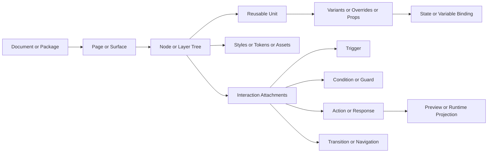

# Mature Reference Systems for UI Design Schema and Interaction Design Schema

## Executive summary

Across the twelve reference systems, four distinct families emerge. **Design-file-first systems** such as Figma, Sketch, and Penpot expose strong scene graphs, reusable components, styles/tokens, and collaboration workflows; **interaction-logic prototyping systems** such as ProtoPie, Axure RP, UXPin, and Flinto add richer trigger/condition/action modeling and form-like behavior; **motion/runtime systems** such as Rive, Origami Studio, Principle, and dotLottie/LottieFiles emphasize timelines, state machines, signal flow, or runtime playback; and **web-runtime hybrids** such as Framer combine visual authoring with a directly publishable web runtime and code-backed component model. This matters because a future local **UI Design Schema** and **Interaction Design Schema** will need to absorb different strengths from different families rather than treating any single product as the authority for all domains. citeturn5search6turn9search1turn32search0turn12search6turn20search1turn24search10turn14search3turn27search1turn30search1

The strongest public “schema authority” sources are not the apps’ marketing pages but their official public interfaces: Figma’s Plugin and REST API types for nodes, reactions, component properties, and variables; Sketch’s official open file format and JSON Schema; dotLottie’s formal package/state-machine specification; Penpot’s technical data model and plugin API; Rive’s editor/runtime docs plus open-source runtimes; and Axure’s formal documentation of events, cases, actions, dynamic panels, variables, repeaters, and generated HTML. By contrast, Flinto and Principle have mature observable behaviors, but comparatively weak public file-format or API transparency, so they are useful as workflow and interaction references more than as authoritative artifact-model donors. citeturn5search6turn6search8turn6search12turn6search1turn9search1turn29search1turn28search2turn31search4turn33search0turn14search2turn20search1turn23search0turn18search0turn17search0

A high-confidence cross-system conclusion is that future local schemas should be separated into at least four conceptual layers, even if they later reference one another: **surface and scene structure**, **reusable UI units and styling/token systems**, **interaction graph and logic**, and **preview/runtime projection**. Mature tools repeatedly distinguish visual containment from behavioral wiring, even when the editor UI blends them together. Figma separates nodes, variables, and reactions; Axure separates widgets, cases, actions, and variables; Rive separates artboards, animations, state machines, and runtime bindings; Penpot separates pages/components/shapes from flows and interactions; UXPin separates components/states from variables/expressions/interactions; and dotLottie separates animations, themes, state machines, and player behavior. citeturn5search18turn6search1turn23search0turn20search1turn14search3turn16search6turn31search4turn32search0turn36search7turn36search5turn35search2turn29search1turn28search2

The biggest design risk for a future local model is **over-absorbing product-specific or proprietary editor constructs**. A local schema should borrow transferable concepts such as surfaces, nodes, components, variants, states, inputs, guards, actions, transitions, tokens, bindings, signals, overlays, and preview/runtime contracts. It should *not* inherit private package internals, product-specific editor affordances, or code/runtime implementation details that only make sense inside one vendor’s environment. Public evidence supports this restraint: open donors exist for Sketch, dotLottie, Penpot, and Rive runtimes, while many other systems expose behavior clearly but keep underlying file internals private or only partially documented. citeturn9search0turn9search1turn28search5turn29search1turn31search4turn31search2turn14search2turn13search1turn19search2turn17search0

## Method and evidence provenance

This report prioritizes **official public specs, official API/docs, official help centers, and official/open-source implementations**. Reverse-engineered or inferred evidence is used only where public documentation is weak and is explicitly labeled as such. In practice, the most reliable artifact-model donors in this set are Sketch’s published file-format specification and JSON Schema, dotLottie’s package/state-machine specification, Penpot’s technical data model and plugin docs, Rive’s official runtime docs plus open-source runtimes, and Figma’s official API types. Flinto and Principle remain behaviorally useful but artifact-opaque; Framer is strong on runtime/component APIs but weaker as a public design-file schema donor; ProtoPie exposes interaction concepts well in docs but not a comparably open project-file spec. citeturn9search1turn29search1turn28search2turn31search4turn31search2turn33search2turn14search2turn13search1turn5search6turn6search1turn17search0turn18search0turn24search2turn24search8turn10search1turn10search7

For provenance, the report uses four evidence classes. **Confirmed by official spec/API/source/docs** means the concept appears in a formal or primary source. **Confirmed by official sample/artifact or official examples** means the concept is demonstrated in product docs, help pages, or open-source runtime examples. **Inferred / reverse-engineered** means behavior is clearly observable but the durable storage model is not publicly specified. **Unknown / private** means no sufficiently authoritative public evidence was found for the requested level of detail. This distinction is especially important for future schema-work because some systems are excellent conceptual donors without being safe file-format donors. citeturn9search1turn28search5turn31search4turn33search1turn17search0turn19search2

A practical consequence is that **UI Design Schema** should prefer donors with observable scene graphs and reusable-unit models, while **Interaction Design Schema** should prefer donors with explicit trigger/guard/action/state abstractions. No single system dominates both domains. Figma, Sketch, and Penpot are strongest on design-file observability; ProtoPie, Axure, and UXPin are strongest on interaction and logic; Rive and dotLottie are strongest on runtime-grade state-machine structure; Origami is strongest on signal-flow composition; Framer is strongest on web-runtime projection; and Principle/Flinto are strongest as compact references for motion and behavior workflows rather than public data models. citeturn9search1turn32search0turn20search1turn35search0turn14search3turn28search2turn27search2turn24search10turn17search0turn18search0

## Cross-cutting findings

The clearest cross-system pattern is a repeated entity stack: **document/package → page/surface/artboard/board → node/layer/widget/shape → reusable unit → style/token/asset → interaction/state/motion → preview/runtime projection**. Different tools name these layers differently, but the structural recurrence is strong enough that it should directly inform future scope boundaries between UI Design Schema and Interaction Design Schema. Figma exposes files/pages/frames/nodes/components/variables/reactions; Sketch exposes document/pages/artboards/layers/symbols/shared styles/flows; Penpot exposes files/pages/boards/shapes/components/tokens/interactions; Rive exposes files/artboards/animations/state machines/view-model bindings; Axure exposes pages/widgets/dynamic panels/repeaters/variables/interactions; and dotLottie exposes a package manifest with animations, themes, and state machines. citeturn5search18turn6search1turn9search0turn9search1turn31search4turn31search2turn14search3turn16search6turn23search0turn21search0turn29search1turn28search2

The most important boundary for future modeling is the line between **visual structure** and **behavioral semantics**. Mature systems repeatedly keep those concerns adjacent but not identical. Sketch, Penpot, and Figma attach interactions to frames/layers, but their layout, styling, and component models remain distinct from navigation/transition data. Axure blurs the line more than most tools because widgets can be both visible UI and behavior containers, yet even Axure still distinguishes widget structure from event/case/action logic and from variables/repeaters. Rive and dotLottie go even further by making animation/state-machine logic first-class runtime objects separate from raw vector layers. citeturn7search2turn34search1turn5search6turn20search1turn21search2turn21search0turn14search3turn16search6turn29search1

A second major pattern is that “state” means different things in different tool families. In design-file-first tools, state often means **variants, component properties, or visibility/appearance changes**. In prototype tools, state broadens into **variables, conditions, conditional branches, current page/screen, or panel state**. In runtime motion tools, state becomes **finite state machines with typed inputs, listeners, and transition actions**. A future local model should therefore avoid collapsing all of these into a single generic “state” object; they are related but not equivalent. citeturn6search6turn6search10turn34search2turn35search0turn36search5turn23search0turn20search0turn14search3turn14search8turn28search2turn30search1

The third pattern is that **preview/runtime contracts** vary materially. Some systems are design-only or prototype-only; some generate HTML; some ship executable runtimes; some expose public APIs for embedding or extending; some merely share a viewer link. That difference is vital for future schema scope. A local schema that aims to be LLM-readable should probably preserve the distinction between a *source design model*, a *prototype projection*, and a *runtime binding model* rather than assuming one object graph can do everything equally well. citeturn21search3turn21search7turn12search5turn12search6turn14search2turn28search7turn24search10turn19search2turn27search1

## System dossiers

**Figma**

**Product positioning; mature workflow; evidence inventory.** Figma is a browser-based collaborative design system whose public schema authority is its official Plugin API and REST API, not MCP tooling. Expert workflow typically starts with pages, frames, components, variants, auto layout, and variables in the design file; interaction work is attached directly to nodes as reactions; preview is via Figma prototype playback/share; handoff/export flows through Dev Mode, exports, REST JSON, or plugins. The highest-confidence evidence for local-schema research is the official node/reaction/action/trigger/component-property/variable documentation and the API changelog announcing advanced prototyping exposure in Plugin and REST APIs. citeturn5search15turn5search18turn5search6turn6search8turn6search12turn6search1turn6search6turn6search10turn5search9turn5search4

**File/project/API/runtime artifact model; interaction model; UI layer model.** Publicly observable entities include file/page/scene nodes, frames, components, instances, component sets, variant properties, component properties, styles, images, text nodes, export settings, and variables/collections. The interaction model is especially important: a `Reaction` contains a `trigger` and one or more `actions`; `Action` includes navigation-like concepts such as `NAVIGATE`, `SWAP`, `OVERLAY`, `SCROLL_TO`, and `CHANGE_TO`; nodes expose a `reactions` property; and triggers carry concrete event semantics and timing such as hover/press/delay/timeout. On the UI side, the public APIs expose node hierarchies, text/image/style handles, component properties, variant group properties, and auto layout-related properties, including plugin-side inferred auto layout helpers. Artifact observability is **high for API-visible structure**, **medium for exact private editor storage**, and **low/unsupported for private `.fig` internals**. citeturn5search18turn5search6turn6search8turn6search12turn6search6turn6search10turn6search14turn5search13turn5search7turn5search4turn0search5

**State/variable/logic; motion/transition; preview/runtime/handoff.** Figma’s state/logic model is still comparatively lightweight versus Axure/ProtoPie/Rive, but it is no longer just click-through prototyping: official docs now expose advanced prototyping actions such as **Set Variable** and **Conditional**, and the Variables REST API explicitly states that variables can be used for design properties and prototyping actions. Motion is present through transitions and action-level animation concepts rather than a separate general-purpose logic engine. Preview/handoff is strong for design/prototype collaboration and machine-readability through APIs, but Figma is not itself a general executable product runtime in the same sense as Rive or Framer’s published site runtime. **Useful contributions** to future schemas: reaction graph structure, node-attached interactions, component property typing, variants, variables, and strong provenance via public APIs. **Facts not to absorb:** private `.fig` internals, heuristic auto-layout inference as canonical truth, and product-specific editor/Handoff affordances that are not core interaction semantics. citeturn5search3turn6search1turn5search9turn6search8turn6search12turn5search4

**Confirmed / inferred / unknown.** Confirmed: reaction/action/trigger objects, component property definitions, variant properties, variables endpoints, node reactions, and export settings. Inferred: the exact persistence structure used internally by Figma’s proprietary file format and how much of editor behavior maps one-to-one to REST/Plugin API objects. Unknown/private: canonical `.fig` package internals. citeturn5search6turn6search6turn6search10turn6search1turn5search18

**Sketch**

**Product positioning; mature workflow; evidence inventory.** Sketch is both a classic design-file donor and a built-in prototype-spec donor. Its mature workflow centers on pages, frames/artboards, layers, symbols, shared styles, libraries, and link-based prototypes with overlays, scrolling, fixed elements, and Smart Animate. Unlike many proprietary tools, Sketch publishes an official file format guide and a formal JSON Schema-based specification, which makes it one of the best sources for UI-layer artifact observability in this survey. citeturn9search0turn9search1turn7search2turn7search6turn7search4turn7search8turn7search10turn7search15

**File/project/API/runtime artifact model; interaction model; UI layer model.** Officially, `.sketch` documents are ZIP archives containing JSON plus binary assets; `meta.json`, `document.json`, `user.json`, and per-page JSON files are explicitly documented. The JavaScript API exposes document/page/artboard/layer/style/library objects, symbols, symbol instances, symbol overrides, and flows on layers/instances. Prototype interactions center on links/hotspots, overlays, scroll areas, fixed-position elements, start points, and layer visibility behavior. The UI layer model is rich and mature: page/artboard hierarchy, symbol source vs symbol instance, override paths, shared styles, libraries, and asset export/inspection are all public. Observability is **high** because the file format and schema are officially published. citeturn9search0turn9search1turn8search0turn9search2turn9search6turn7search2turn7search6turn7search8

**State/variable/logic; motion/transition; preview/runtime/handoff.** Sketch’s logic model is relatively shallow: it has prototype links, overlays, scroll areas, and Smart Animate, but not the broader variables/conditions/business-rule model seen in Axure, ProtoPie, or UXPin. Motion is meaningful in prototype transitions, especially Smart Animate, but it is still transition-centric rather than a general runtime state system. Preview/runtime lives in preview flows, shareable prototypes, and iOS/device preview rather than a general-purpose shipped runtime. **Useful contributions** to future schemas: open file/document structure; separate metadata/document/user/page layers; symbol/instance/override modeling; start points, overlay semantics, and “fixed while scrolling” behavior. **Facts not to absorb:** Sketch-specific bundle layout details as required local shape, or undocumented `sketchtool dump` JSON, which Sketch itself says differs from the official format and should not be treated as authoritative. citeturn7search10turn7search15turn7search2turn9search3turn8search0

**Confirmed / inferred / unknown.** Confirmed: file bundle structure, JSON Schema specification, symbol/source/instance/override APIs, prototype overlays/scroll/fixed behavior. Inferred: precise persistence of newer prototype options not exhaustively exposed in the high-level docs. Unknown/private: little, compared with most proprietary peers, because official format observability is unusually strong. citeturn9search0turn9search1turn8search0turn7search2

**Flinto**

**Product positioning; mature workflow; evidence inventory.** Flinto is a mature app-focused prototyping tool optimized for screen-to-screen transitions plus **within-screen behaviors**. Expert workflow usually starts from imported Sketch/Figma screens or native screen/layer authoring, then adds links/gestures between screens and uses the Behavior Designer for intra-screen states, hover/active/toggle/menu/looping/scroll-based behaviors. The primary evidence base is official learning docs and product docs; public file-format/API observability is weak. citeturn18search8turn18search16turn18search0turn18search2turn18search6

**File/project/API/runtime artifact model; interaction model; UI layer model.** Observable entities in docs are documents, screens, layers, groups, links, gestures, transitions, behaviors, behavior states, timer links, scroll groups, and animation tags. Links connect screens; gestures are attached to links/layers; behaviors are stateful interactions that happen within a single screen. Scroll groups are separate layer-group constructs for content scrolling, and Flinto explicitly supports scroll-driven behavior links. The UI layer model is screen/layer/group-centric and sufficient for prototyping, but public artifact-level field definitions are not formally specified. Observability is therefore **moderate for concepts**, **low for public file internals**. citeturn18search16turn18search7turn18search0turn18search3turn18search11turn18search18

**State/variable/logic; motion/transition; preview/runtime/handoff.** Flinto’s state model is strong for visual behavior states but weak for more general variables, formulas, or business-rule logic. It offers timer links, scroll gestures, animation-tag reuse, screen transitions, and spring/classic timing controls, making it a useful interaction-and-motion donor for “app-like” UI behaviors. Preview is strong on Mac and iOS viewer/live preview workflows, and `.flinto` files are directly shareable to the iOS viewer and Mac users; share also supports recorded `.mov` or `.gif`. **Useful contributions** to future schemas: explicit distinction between screen-to-screen links and same-screen behavior-state transitions, scroll group + scroll-driven state progression, timer links, and animation-tag matching. **Facts not to absorb:** undocumented `.flinto` internals, any hidden private serialization, and editor-specific conveniences such as Dribbble export or tap-hint viewer settings. citeturn18search4turn18search9turn18search3turn18search11turn19search0turn19search1turn19search2turn19search4turn0search6

**Confirmed / inferred / unknown.** Confirmed: behaviors, behavior states, screen links, gestures, timer links, scroll groups, preview/share patterns. Inferred: exact data model behind behavior/state persistence and transition-tag matching internals. Unknown/private: formal `.flinto` package spec or public API. citeturn18search0turn18search4turn18search3turn19search2

**ProtoPie**

**Product positioning; mature workflow; evidence inventory.** ProtoPie is a high-fidelity interaction prototyping system built around explicit interaction logic rather than only link navigation. Expert workflow typically imports from Figma/Sketch/XD, organizes scenes and components, attaches triggers to responses, introduces variables and formulas, and uses send/receive channels, devices, sensors, and ProtoPie Connect when prototypes need multi-device or API/hardware integration. The strongest evidence is official docs for triggers, responses, formulas, variables, components, Connect, Cloud, and Player. Public project-file observability is weaker than the conceptual docs. citeturn11search14turn11search7turn10search1turn10search7turn11search0turn12search0turn11search16turn12search6

**File/project/API/runtime artifact model; interaction model; UI layer model.** Observable entities include scenes, layers, triggers, responses, variables, formulas, components, variable overrides, send/receive messages, channels, and device/player/cloud/connect artifacts. ProtoPie’s interaction model is unusually rich: triggers include touch, voice, receive, conditional/chain, and sensor/device triggers such as compass, sound, 3D Touch, and proximity; responses are typed actions attached to those triggers; messages cross scene/component/device boundaries through channels. The UI layer model is adequate but secondary: imported layer hierarchy, positioning, constraints, and component instances are part of the workflow, but the main schema value is the interaction graph. citeturn10search1turn10search7turn12search1turn11search16turn11search1turn11search23

**State/variable/logic; motion/transition; preview/runtime/handoff.** Variables and formulas are first-class in ProtoPie, and the docs explicitly position them as reusable dynamic logic tools. Component instances can override variable defaults; send/receive can modularize interaction logic inside and outside components; and Connect adds API, device, hardware, and multi-screen integration. Motion is handled through responses and transitions, but it remains tightly coupled to interaction flow rather than standalone timeline authoring. Preview/runtime/handoff is split between Studio, Player, Cloud, and Connect; sharing can target browser, Player, comments, and engineer handoff via interaction recordings. **Useful contributions** to future schemas: trigger/response separation, sensor input taxonomy, component communication channels, variable/formula model, and explicit multi-device runtime-binding concepts. **Facts not to absorb:** private `.pie` structure unless publicly documented, and ProtoPie-specific channel names or Connect plugins as universal interaction primitives. citeturn11search0turn12search0turn11search16turn11search1turn12search3turn12search6turn12search7turn12search2turn12search5

**Confirmed / inferred / unknown.** Confirmed: triggers, responses, variables, formulas, components, variable overrides, send/receive, Player/Cloud/Connect roles. Inferred: detailed serialized project-file model and full runtime package structure. Unknown/private: canonical `.pie` file internals. citeturn10search1turn10search7turn11search0turn11search16turn12search2turn12search6

**Rive**

**Product positioning; mature workflow; evidence inventory.** Rive is a runtime-grade interactive animation platform spanning editor, typed state machines, data binding, and open-source runtimes. Expert workflow typically imports/designs assets into artboards, builds animations, then adds state machines, listeners, transitions, and runtime bindings; developers consume `.riv` assets through platform runtimes. Official runtime docs and open-source runtime repositories are strong primary evidence; editor docs are also good. Public information suggests `.riv` is the runtime asset format, while `.rev` is referenced publicly as editor/source terminology on Rive’s official blog, but that distinction is less formalized in the help docs than runtime APIs are. citeturn14search2turn13search1turn13search5turn13search7turn15search1

**File/project/API/runtime artifact model; interaction model; UI layer model.** Observable entities include files, artboards, assets, animations, state machines, layers, listeners, transitions, inputs, and increasingly **view models / data binding**. State machines have states, transitions, conditions, and actions; listeners have targets, conditions, and actions; runtimes expose state-machine playback and low-level rendering APIs; assets can be loaded or replaced dynamically. The UI/art layer model is artboard-centric and animation-native rather than app-screen-centric, so it is valuable for interactive graphics/UI fragments rather than full app information architecture. citeturn14search3turn14search0turn14search8turn16search6turn14search7turn13search1

**State/variable/logic; motion/transition; preview/runtime/handoff.** Rive is one of the strongest references for **runtime-grade interaction state**. Official docs now describe the legacy Inputs system as deprecated for new work and position **Data Binding / View Models** as best practice; runtime docs show direct binding APIs and state-machine control at runtime. Motion is deep: authored timelines, animation blending, transition duration/interpolation/exit time, listeners, and render-loop control. Preview/runtime/handoff is not “share my prototype” first; it is “ship this interactive asset into apps, games, and websites” first, via open-source runtimes for web, React, Flutter, iOS/macOS, Android, Unity, and more. **Useful contributions** to future schemas: typed runtime inputs, explicit guard/action transitions, separate editor-state-machine vs runtime-binding layers, and provenance distinction between animation data and runtime integration surface. **Facts not to absorb:** renderer/package-specific details, beta/dev version specifics, or product-specific scripting/editor features as universal schema requirements. citeturn16search4turn13search14turn16search3turn14search8turn14search0turn14search2turn15search0turn13search1turn13search7

**Confirmed / inferred / unknown.** Confirmed: artboards, runtime playback, inputs, transitions, listeners, data binding contracts, asset loading, open-source runtimes. Inferred: exact editor-source persistence model and the stable formal role of `.rev` in public docs. Unknown/private: any fully formal public editor-file spec comparable to Sketch’s. citeturn14search2turn14search3turn14search0turn14search8turn13search1turn13search14

**Principle**

**Product positioning; mature workflow; evidence inventory.** Principle is a motion- and interaction-focused authoring tool for screen transitions and continuous interactions. Mature workflow typically imports artboards from Sketch/Figma, arranges artboards as states, adds events between artboards, customizes animations in the Animate panel, and builds continuous interactions with Drivers. Official documentation is detailed about behavior and workflow, but public file-format/API observability is limited. citeturn1search1turn17search0turn1search3

**File/project/API/runtime artifact model; interaction model; UI layer model.** Publicly observable entities include artboards, layers, groups, preview, animate panel, drivers panel, events, driver keyframes, and components. Principle treats artboards as unique visual states; events trigger transitions between artboards; drivers support continuous interactions; and components encapsulate their own artboards, events, and animations independent of the parent. Groups are container-like objects with their own transform semantics, which makes Principle a useful donor for compositional layer behavior. Public docs do not provide a formal schema or file spec for these constructs. citeturn1search1turn17search0

**State/variable/logic; motion/transition; preview/runtime/handoff.** Principle’s strongest contributions are motion/timeline/driver concepts, drag/scroll/paging gestures, embedded interactive components, and clear separation between event-based transitions and driver-based continuous control. It is weak on variables, formulas, conditions, and business-rule logic compared with ProtoPie, Axure, or UXPin. Preview is central: live preview can be detached, mirrored, and exported; sharing includes web sharing in newer versions plus video/GIF export. **Useful contributions** to future schemas: driver-driven motion, continuous interactions, embedded stateful components, and the notion that event transitions and continuous controls are separate interaction families. **Facts not to absorb:** implicit editor canvas layout rules, private document serialization, and rasterization/import workarounds like `principle flatten` as schema primitives. citeturn17search0turn1search3

**Confirmed / inferred / unknown.** Confirmed: artboards, preview, animate panel, drivers, events, components, import/re-import/export/share behavior. Inferred: exact persistence model for artboards, drivers, component state, and exports. Unknown/private: formal project-file schema and public runtime API. citeturn17search0turn1search3

**Axure RP**

**Product positioning; mature workflow; evidence inventory.** Axure RP is the strongest functional-prototype donor in this set. Expert workflow is page/widget-first, but interaction logic is central: authors attach events to widgets/pages, build ordered cases with actions, add conditions and expressions, use dynamic panels for stateful containers, use repeaters for dataset-driven repeated UI, and publish generated HTML locally or to Axure Cloud. Axure’s reference docs provide unusually strong coverage of interaction semantics, HTML publishing, and browser preview/player behavior. citeturn20search1turn20search0turn23search0turn21search0turn21search2turn22search0turn21search3turn21search7turn21search8

**File/project/API/runtime artifact model; interaction model; UI layer model.** Axure publicly documents pages, widgets, events, cases, actions, variables, dynamic panels with named states, repeaters with datasets/items, selection groups, and HTML generator settings. The interaction model is explicit and mature: events fire, ordered cases execute, conditions gate or chain IF/ELSE behavior, and actions operate sequentially. Dynamic panels are especially important because they combine UI containment with panel-specific runtime state, scrolling, pinning, drag/swipe, and `Set panel state`. This makes Axure a major donor for panel/modal/overlay/stateful-container modeling. citeturn20search1turn20search0turn23search0turn21search0turn21search4

**State/variable/logic; motion/transition; preview/runtime/handoff.** Axure’s state/logic model is among the richest in public documentation: global variables store text/numbers; expressions support math, functions, string/date logic, widget properties, and booleans; repeaters bring table-like data binding and sorting/filtering/pagination behavior; conditions support IF/ELSE chains and multiple independent chains; and dynamic panels encode named visual states. Motion exists but is subordinate to functional behavior. Preview/runtime/handoff is concrete: Axure generates HTML, supports local publishing and Axure Cloud sharing, and the prototype player exposes page structure, notes, discussions, and variable inspection in the browser. **Useful contributions** to future schemas: ordered event-case-action semantics, explicit branching, panel states, repeater/dataset concepts, validation patterns, and generated-runtime projection. **Facts not to absorb:** generator-specific HTML settings or browser-player chrome as core domain concepts; those belong in projection metadata, not in the Interaction Design Schema itself. citeturn21search2turn22search0turn21search0turn20search0turn23search0turn21search3turn21search7turn21search1

**Confirmed / inferred / unknown.** Confirmed: events/cases/actions, conditional logic, dynamic panels, repeaters, variables/expressions, HTML generation, player/Cloud behaviors. Inferred: exact internal project-file serialization and how all editor data maps onto published HTML/JS. Unknown/private: full native project-file internals. citeturn20search1turn20search0turn23search0turn21search0turn21search3

**Framer**

**Product positioning; mature workflow; evidence inventory.** Framer is a hybrid system: visual design environment, code-component host, CMS-backed site builder, and published web runtime. Mature workflow often mixes visual frames/components/layout with triggers, variants, CMS/Fetch data, and code components or overrides; publishing is to a live web runtime rather than to a pure prototype viewer. The strongest primary evidence is Framer’s developer docs for code components, overrides, property controls, nodes, CMS, plugins, server API, and official help docs for event variables, triggers, layout grids, Fetch, and responsive layout guidance. citeturn24search10turn24search7turn24search0turn24search8turn1search9turn1search12turn25search2turn25search9turn25search3turn25search17

**File/project/API/runtime artifact model; interaction model; UI layer model.** Publicly observable entities include project nodes/layers (`FrameNode`, `TextNode`, `SVGNode`, `CodeComponentNode`), code files, code components, overrides, plugin-insertable component instances, property controls, CMS collections, and fetched data. Interaction concepts are often expressed through component variants, triggers, event variables, and runtime-visible component behavior rather than through a standalone prototyping DSL. UI layer strength is high for web surfaces: layout grids, responsive stacks/fluid constraints, pages/components, and published-site projection are all first-class. Artifact observability is **medium** for document structure via public APIs, **high** for code/runtime-facing objects, and **low** for any private design-file serialization. citeturn24search8turn24search2turn24search6turn24search0turn25search3turn25search7turn24search10

**State/variable/logic; motion/transition; preview/runtime/handoff.** Framer’s state/logic model is web-runtime-oriented. Event variables let nested components trigger actions such as opening overlays or changing variants elsewhere; official trigger docs show parameter conditions and repeat windows; Fetch attaches dynamic data to text, component properties, or layers and exposes loading/error variants; code components and overrides are rendered on canvas, in preview, and on published sites. This makes Framer a strong donor for **runtime projection contracts** and **code-backed component props**, but a riskier donor for general product-behavior semantics because some of its power lives in React/code rather than purely declarative interaction objects. **Useful contributions** to future schemas: prop/property-control surfaces, web-runtime projection, published-site parity, event-variable/event-propagation ideas, and loading/error visual states around data binding. **Facts not to absorb:** React-specific implementation patterns, code override mechanics, or server/plugin API classes as if they were universal interaction concepts. citeturn25search9turn25search2turn25search17turn24search10turn24search7turn1search12

**Confirmed / inferred / unknown.** Confirmed: code components, overrides, property controls, node types, CMS/plugin/server APIs, event variables, triggers, and responsive layout guidance. Inferred: a complete canonical design-file object model for purely visual Framer projects independent of runtime code. Unknown/private: proprietary source-file internals and exhaustive non-code interaction serialization. citeturn24search10turn24search7turn24search0turn24search8turn1search12turn25search9

**Origami Studio**

**Product positioning; mature workflow; evidence inventory.** Origami Studio is a patch-graph and signal-flow prototyping system. Mature workflow combines a layer hierarchy with a patch editor: users add layers/components, use quick interactions to insert interaction/scroll patches, wire outputs to layer properties, and preview live on mobile devices. Official documentation is good for patch behavior, components, and live preview; public serialized project-model transparency is limited. citeturn26search1turn27search8turn27search2turn27search3turn27search1

**File/project/API/runtime artifact model; interaction model; UI layer model.** Observable entities include layers, patch graph, ports, connections, components, component input/output ports, layer libraries, patch libraries, and platform/device components. Interaction is explicitly signal-based: the `Interaction` patch emits `Down`, `Tap`, `Position`, and `Force`; scroll behavior is added by inserting `Scroll X/Y` patches; logic is built by composing Interaction, Switch, Transition, Delay, Splitter, Wireless, and math patches; and component ports can be published from inside patch groups to the outer component surface. The UI and behavior models are therefore separate but bridged by port bindings. citeturn27search2turn27search3turn27search18turn26search1turn26search3

**State/variable/logic; motion/transition; preview/runtime/handoff.** Origami is one of the best references for **signal-flow composition** and for the idea that interaction logic can be expressed as a graph of values, pulses, and transitions connected to layer properties. It is weaker as a donor for app-level page routing, formal conditions/branching text syntax, or public file-schema observability. Preview/runtime is mature for device mirroring and sharing through Origami Live apps rather than for broad web publishing. **Useful contributions** to future schemas: explicit property-binding edges, published component ports, interactive signals, and the distinction between a layer tree and a behavior graph. **Facts not to absorb:** specific patch names or editor shortcuts as if they were universal schema primitives, and private project-file structure. citeturn27search2turn27search3turn27search16turn27search14turn27search1turn26search1

**Confirmed / inferred / unknown.** Confirmed: interaction patch outputs, component input/output publication, platform/device/document component categories, live preview/sharing. Inferred: full internal data model for patch graphs and persistence. Unknown/private: formal open project-file schema and public runtime API equivalent to Rive or dotLottie. citeturn27search2turn26search1turn27search1

**dotLottie and LottieFiles State Machine**

**Product positioning; mature workflow; evidence inventory.** dotLottie is an open package format for one or more Lottie animations plus associated assets, themes, and state machines; LottieFiles Creator adds an authoring environment with visual state-graph editing, inputs, interactions, actions, preview, and export. This pair is the most formal **open state-machine package** reference in scope and one of the best donors for a runtime-oriented Interaction Design Schema because the package structure and state-machine JSON model are explicitly documented. citeturn28search5turn29search1turn28search2turn30search1

**File/project/API/runtime artifact model; interaction model; UI layer model.** Official spec says a `.lottie` file is a Deflate ZIP archive with a root `manifest.json` and folders such as `a/` for animations, `i/` for images, `t/` for themes, `s/` for state machines, and `f/` for fonts. The manifest lists animations, themes, state machines, and initial asset selection. State-machine files define `initial`, `states`, `interactions`, and `inputs`; states contain transitions; transitions may have guards and actions; and the Creator docs describe input types such as boolean, numeric, string, and event, with interactions like click and pointer events and actions such as set input value, fire event, open URL, toggle boolean, reset, and set theme. The UI layer model is weaker here than in Figma/Sketch/Penpot because the system is animation/package-first, but Lottie Creator still exposes scene/layer hierarchies and drawing/timeline concepts. citeturn29search1turn28search2turn30search1turn28search6

**State/variable/logic; motion/transition; preview/runtime/handoff.** This is a high-value donor for formal runtime behavior. Transitions can be instant or tweened; state-machine JSON is explicit; player docs show programmatic playback (`play`, `pause`, `stop`, `setSpeed`, `setFrame`, `setSegment`) through the web player; and official runtimes such as dotLottie Web and Android advertise theming and state-machine control. Preview/export is strong in Creator and strong in runtime distribution, but it is narrower than Axure/ProtoPie for product-UI logic because it stays near interactive animation semantics. **Useful contributions** to future schemas: explicit package manifest, separable animations/themes/state machines, typed inputs, guard/action transitions, and runtime/player API boundaries. **Facts not to absorb:** Lottie-specific vector-animation layer quirks, Creator-only AI/plugin affordances, or package-directory naming as mandatory local schema structure. citeturn30search1turn28search7turn4search13turn28search2turn29search1

**Confirmed / inferred / unknown.** Confirmed: package structure, manifest fields, state-machine JSON shape, input/action categories, player runtime controls. Inferred: stability and breadth of the newer Creator state-machine authoring surface across versions. Unknown/private: none at the package-spec level; this is comparatively open. citeturn29search1turn28search2turn28search7turn30search1

**Penpot**

**Product positioning; mature workflow; evidence inventory.** Penpot is an open-source design and prototyping platform whose public evidence is unusually good because it spans user docs, technical docs, source code, plugin APIs, and public resource repositories. Mature workflow is design-file-first: files contain pages, boards, shapes, components, assets, and design tokens; prototypes are built by connecting boards into flows/interactions; layouts are expressed using flex/grid concepts aligned with web standards; libraries and shared assets support design systems; and plugins/MCP can programmatically inspect or modify designs. citeturn3search8turn32search0turn34search1turn34search0turn32search1turn34search12turn31search6turn34search13

**File/project/API/runtime artifact model; interaction model; UI layer model.** Official technical docs state that file `data` contains pages and library assets such as components, media items, colors, and typographies; pages and components are modeled via a shared `Container` abstraction; and shapes sit underneath that. User docs expose boards, shapes, texts, paths, graphics, assets, components, variants, libraries, and design tokens. The plugin docs and FAQ explicitly name prototyping API methods such as `createFlow`, `addInteraction`, and `removeInteraction`. Penpot’s UI layer model is particularly strong for schema research because it is open, web-oriented, and deliberately aligned with CSS concepts such as Flexbox and CSS Grid. citeturn31search2turn31search4turn34search3turn34search0turn34search2turn34search12turn32search1turn34search1turn32search2turn33search2

**State/variable/logic; motion/transition; preview/runtime/handoff.** Penpot’s interaction model is presently lighter than Axure/ProtoPie/UXPin and more comparable to design-tool prototyping: flows define starting points, boards act as screens, and interactions connect screens with triggers/actions/animations for view-mode playback and sharing. Its major added value is on the **UI Design Schema** side: components, variants, shared libraries, and design tokens that explicitly follow the W3C DTCG token format, including sets, themes, aliases, equations, and JSON import/export. Preview/handoff is design/view-mode/share-first, with increasingly important machine-readable access through plugins and MCP rather than a general-purpose executable app runtime. **Useful contributions** to future schemas: open data model, page/container abstraction, token openness, CSS-aligned layout modeling, and API-level creation of flows/interactions. **Facts not to absorb:** Penpot implementation details specific to its own React/Rumext codebase or internal design-system Storybook organization; those are application internals, not neutral schema concepts. citeturn32search0turn32search1turn34search1turn31search4turn31search2turn32search2turn34search13

**Confirmed / inferred / unknown.** Confirmed: open-source platform posture, file/page/asset data-model descriptions, plugin permissions and APIs, flows/interactions, DTCG-based tokens, variants, and flexible layouts. Inferred: exact exported/imported `.penpot` package structure beyond what is exposed in public docs/issues. Unknown/private: little at the conceptual level, though some artifact details still require source or sample-file inspection. citeturn31search6turn31search4turn31search2turn33search2turn32search1turn34search2

**UXPin**

**Product positioning; mature workflow; evidence inventory.** UXPin is a realistic-prototype system that spans classic editor-driven interactions and variables, component states, forms/validation flows, design-system libraries, and code-backed components via Merge and Storybook integration. Mature workflow often uses reusable components and states, attaches interactions with conditions and else branches, stores data in global variables, uses expressions for validation/business-like logic, and then previews, shares, or hands off through Get Code / spec modes. citeturn36search7turn35search0turn36search5turn35search2turn35search3turn36search1turn36search2

**File/project/API/runtime artifact model; interaction model; UI layer model.** Public docs expose pages/frames/components/instances/states/variables/interactions and, in Merge, code-backed components whose props can be surfaced through Storybook Args or JSDoc conventions. Interaction docs list a wide trigger/action surface including key press, scroll, page load, window resize, variable change, show/hide/toggle, go to page, set state, set variable, and scroll to. UXPin’s UI layer model includes components and design-system libraries, but its distinctive strength is that visual components can be backed by real code libraries, especially through Merge. citeturn36search7turn36search3turn36search1turn36search9

**State/variable/logic; motion/transition; preview/runtime/handoff.** UXPin has one of the richer public logic surfaces among design-oriented tools: variables are global across pages; expressions support regex, string/date/math operations and validation scenarios; states can be edited per component instance and treated as overrides; interactions support conditional logic and explicit if-else chaining; and official form tutorials show real validation flows using focus, empty checks, regex/email validation, state changes, and confirmation overlays. Motion exists but is secondary to product behavior. Preview/handoff is strong: Get Code mode can expose JSX/CSS and React project configuration for supported libraries, though full code export has stated beta/support scope limits. **Useful contributions** to future schemas: global variables, expression language, instance-level state overrides, practical form-validation patterns, and code-backed component projection. **Facts not to absorb:** UXPin-specific export/code-mode limitations, Storybook/portal annotations, or Forge AI workflows as if they were universal runtime semantics. citeturn36search5turn35search2turn36search0turn35search0turn35search3turn36search2turn36search1turn36search9

**Confirmed / inferred / unknown.** Confirmed: components/instances, states, variables, triggers/actions, if-else conditions, expressions, validation tutorials, Storybook-driven Merge properties, Get Code mode. Inferred: full internal project-file representation and exact serialization contract between classic UXPin editor objects and Merge-backed components. Unknown/private: native `.uxp` internals and exhaustive runtime object model. citeturn36search7turn36search0turn36search5turn35search2turn35search3turn36search1turn36search2

## Cross-system comparison

The first table compares the most transferable **core entities** each system makes public. It is a synthesis of the system dossiers above and highlights where each system most clearly contributes reusable structural concepts. citeturn9search1turn31search4turn29search1turn20search1turn24search8turn14search3turn36search7

| System | Primary container | Reusable unit | Behavior unit | Runtime / preview artifact | Evidence basis |
|---|---|---|---|---|---|
| Figma | File → Page → Frame/Node | Component / Component Set / Instance / Variant | Reaction with Trigger + Action(s) | Prototype preview, exports, REST JSON | citeturn5search18turn5search6turn6search8turn6search12 |
| Sketch | Document → Page → Artboard/Layer | Symbol Source / Symbol Instance / Override | Flow / hotspot / overlay / scroll / Smart Animate | Preview/share prototype, `.sketch` bundle | citeturn9search0turn8search0turn7search2turn7search6 |
| Flinto | Document → Screen → Layer/Group | Reusable transitions/behaviors via tags | Link/gesture, behavior state, timer, scroll gesture | Mac/iOS viewer, `.flinto`, video/GIF | citeturn18search0turn18search16turn18search9turn19search2 |
| ProtoPie | Pie/scene/component/layer | Component + variable overrides | Trigger / Response / Variable / Formula / Send-Receive | Studio, Player, Cloud, Connect | citeturn10search1turn10search7turn11search16turn12search6 |
| Rive | File → Artboard | Componentized artboards/assets | State Machine / Listener / View Model binding | `.riv` + open-source runtimes | citeturn14search3turn14search0turn16search6turn13search1 |
| Principle | Document → Artboard → Layer | Component | Event transition + Driver | Preview, mirrored preview, web/video export | citeturn17search0turn1search3 |
| Axure RP | Project → Page → Widget | Dynamic Panel / Repeater / Component-like widget groupings | Event / Case / Action / Variable / Expression | Generated HTML, Axure Cloud, browser player | citeturn20search1turn23search0turn21search0turn21search3 |
| Framer | Project → Node/Page | Component / Code Component / Override | Variant trigger, event variable, code-backed behavior | Published site runtime, preview, server/plugin APIs | citeturn24search8turn24search10turn25search9turn1search12 |
| Origami Studio | Document → Layer tree + Patch graph | Component with published ports | Patch graph signal flow | Origami Live preview/share | citeturn26search1turn27search2turn27search1 |
| dotLottie / LottieFiles | Package manifest | Animation / Theme / State Machine | State / Transition / Guard / Input / Action | dotLottie players and runtimes | citeturn29search1turn28search2turn28search7 |
| Penpot | File → Page/Container → Board/Shape | Component / Variant / Library asset | Flow / Interaction | View mode/share, plugins/MCP | citeturn31search4turn34search0turn34search2turn32search0turn32search2 |
| UXPin | Project → Page/Frame/Canvas | Component / State / Merge component | Trigger / Action / Condition / Variable / Expression | Preview/share, Get Code, Merge runtime projection | citeturn36search7turn36search0turn36search5turn36search2 |

The second table gives a qualitative matrix for **schema-design suitability**. “High/Medium/Low” here is not popularity; it is a research judgment about how useful and observable each system is for informing an LLM-readable local model. citeturn5search6turn9search1turn20search1turn14search3turn29search1turn31search4turn36search5

| System | Design-file observability | Interaction depth | UI layer strength | State-machine strength | Variable / expression strength | Functional prototype strength | Motion / timeline strength | Runtime / API strength | Open-source / open-spec strength | Suitability for local schema design | Evidence basis |
|---|---|---|---|---|---|---|---|---|---|---|---|
| Figma | High | Medium | High | Low-Medium | Medium | Medium | Medium | High | Low-Medium | High for mixed UI+interaction baseline | citeturn5search6turn6search1turn6search6turn5search18 |
| Sketch | High | Medium | High | Low | Low | Medium | Medium | Medium | High | High for UI Design Schema | citeturn9search1turn7search2turn8search0 |
| Flinto | Low | Medium | Medium | Low | Low | Medium | Medium-High | Low | Low | Medium for behavior-state patterns | citeturn18search0turn18search3turn19search2 |
| ProtoPie | Low-Medium | High | Medium | Medium | High | High | High | Medium | Low | High for Interaction Design Schema | citeturn10search1turn10search7turn11search0turn12search6 |
| Rive | Medium | High | Medium | High | High | Medium | High | High | High on runtimes, lower on editor file spec | High for runtime interaction schema | citeturn14search3turn16search6turn13search1turn13search14 |
| Principle | Low | Medium | Medium | Low | Low | Low-Medium | High | Low | Low | Medium for motion/driver modeling | citeturn17search0turn1search3 |
| Axure RP | Medium | High | Medium | Medium | High | High | Medium | Medium | Low-Medium | High for Interaction Design Schema | citeturn20search1turn20search0turn23search0turn22search0 |
| Framer | Medium | Medium-High | High | Low-Medium | Medium | Medium | Medium | High | Low-Medium | High for runtime projection and props | citeturn24search10turn24search8turn25search9turn1search12 |
| Origami Studio | Low-Medium | High | Medium | Low-Medium | Medium via graph logic | Medium | High | Low-Medium | Low | High for signal-flow ideas | citeturn27search2turn26search1turn27search1 |
| dotLottie / LottieFiles | High for package spec | Medium-High | Low-Medium | High | Medium | Low-Medium | High | High | High | High for formal runtime behavior package | citeturn29search1turn28search2turn28search7turn30search1 |
| Penpot | High | Medium | High | Low-Medium | Medium on tokens more than behavior logic | Medium | Medium | Medium | High | High for open UI Design Schema foundations | citeturn31search4turn32search1turn32search0turn33search2 |
| UXPin | Medium | High | Medium-High | Low-Medium | High | High | Medium | Medium-High | Low-Medium | High for product-behavior and code-backed UI | citeturn36search0turn36search5turn35search0turn36search1turn36search2 |

## Implications for future local schemas

For a future **UI Design Schema**, the most reusable donors are Figma, Sketch, Penpot, Framer, and parts of UXPin. The consistently transferable concepts are: document/page/surface hierarchy; nodes/layers/boards/frames; reusable components and instances; variants or stateful visual alternatives; override points; assets; styles/tokens/variables; and responsive/flexible layout information. Sketch and Penpot are especially valuable because they publish structural models; Figma is invaluable because its API surface is practical and broad; Framer is useful because it forces a serious relationship between authored structure and published web runtime; and UXPin adds realistic component/state behavior in a design-system context. citeturn9search1turn31search4turn32search1turn5search18turn6search6turn6search10turn24search8turn25search3turn36search7turn36search0

For a future **Interaction Design Schema**, the strongest donors are Axure RP, ProtoPie, Rive, dotLottie, Origami, and selected parts of Figma/UXPin/Penpot. The key transferable abstractions are: trigger/event source, target actor, guard/condition, ordered action list, variable/input update, navigation/presentation action, state transition, timed transition, gesture-driven progress, and channel/signal communication. Axure contributes explicit branching and ordered cases; ProtoPie contributes trigger/response, device sensors, formulas, and send/receive; Rive contributes typed runtime state machines and bindings; dotLottie contributes a formal package-level state machine; Origami contributes signal-flow graph wiring; Figma contributes node-attached reactions; UXPin contributes conditional interactions and form validation; Penpot contributes flow/interactions attached to design surfaces. citeturn20search1turn20search0turn10search1turn10search7turn11search0turn14search3turn16search6turn28search2turn29search1turn27search2turn5search6turn35search0turn32search0

A third schema concern is **projection**. The surveyed systems show that source design structure, prototype behavior, and executable runtime projection are not the same thing. Axure generates HTML. Framer publishes a web runtime. Rive and dotLottie ship runtime assets consumed by code. ProtoPie splits Studio/Cloud/Connect/Player. Figma and Penpot expose APIs and viewers around source designs. UXPin bridges toward code export and Merge-backed real components. A future local model should therefore preserve a distinct projection layer that can represent “preview-only,” “design-viewer,” “generated HTML prototype,” “embedded runtime asset,” or “published web artifact” without pretending these are interchangeable. citeturn21search3turn24search10turn14search2turn28search7turn12search2turn12search6turn6search1turn34search13turn36search2

The strongest cross-system argument for **evidence traceability** is that the confidence of a local schema element should vary by donor. Some concepts are confirmed by formal specs or open APIs; others are only demonstrated in tutorials or help pages; others are merely inferred from editor behavior. A future local model would benefit from built-in provenance metadata at the level of concept families, field families, or coverage annotations: “official spec,” “official API,” “official docs only,” “official sample/example,” “open-source implementation,” “inferred from behavior,” or “unknown/private.” That would let the schema remain broad without overstating certainty. citeturn9search1turn29search1turn31search4turn14search2turn17search0turn19search2

Several things should **not** be absorbed into either schema. Proprietary package internals from `.fig`, `.flinto`, `.pie`, `.uxp`, Principle documents, or opaque Framer source artifacts should not become local-schema structure. Pixel styling or export/rendering quirks should not become behavior. React/HOC/plugin/server/runtime classes in Framer, renderer details in Rive, Axure HTML generator toggles, Flinto/Principle/Origami editor affordances, and Creator AI/plugin features in LottieFiles are implementation or tooling details, not stable interaction semantics. The local schemas should prefer transferable domain abstractions over application internals. citeturn19search2turn17search0turn24search7turn1search12turn14search2turn21search1turn30search1

## Research gaps and recommended next evidence

The largest research gap is **artifact-level observability for the closed-file tools**. Flinto, Principle, ProtoPie, UXPin, and most of Framer’s pure-authoring model are well documented behaviorally but not publicly specified at the storage-model level. The next evidence to collect should be a curated corpus of **public sample files and exported artifacts** for each of those systems, with careful reverse-engineering limited to publicly obtained examples and clearly separated from official evidence. That is especially important if future schema work needs to capture nuanced behavior-state persistence rather than only editor-visible concepts. citeturn19search2turn17search0turn11search14turn36search2turn24search2

A second gap is **runtime projection comparability**. Rive, dotLottie, Framer, Axure, ProtoPie Connect, and UXPin Get Code all project into very different runtimes or code surfaces. The next evidence should assemble a side-by-side sample set for one common interaction pattern—such as a validated form, overlay menu, carousel, or drag interaction—implemented in each system’s public sample or tutorial materials, then compare what survives into runtime/export. That would clarify which concepts belong to a neutral projection contract and which are just editor conveniences. citeturn14search2turn28search7turn21search3turn12search6turn36search2

A third gap is **behavioral equivalence across different modeling styles**. The survey shows at least four different but overlapping paradigms—trigger/action trees, IF/ELSE case logic, state machines, and patch/signal graphs. Future evidence collection should explicitly map the same interaction across those paradigms to determine the minimum neutral vocabulary that can represent all of them without collapsing away important distinctions. The most useful next donors for that mapping exercise are Axure, ProtoPie, Rive, dotLottie, and Origami, with Figma/UXPin/Penpot as attachment-oriented counterpoints. citeturn20search1turn20search0turn10search1turn10search7turn14search3turn28search2turn27search2turn5search6turn35search0turn32search0

**Open questions and limitations.** This report did not inspect a broad corpus of raw proprietary project files, and it intentionally did not reproduce private file internals. As a result, several storage-level questions remain open for Flinto, Principle, ProtoPie, UXPin, and Framer. The highest-confidence conclusions are therefore about **concept models, public APIs/specs/docs, observable workflows, and schema implications**, not about every vendor’s exact on-disk serialization. citeturn9search1turn29search1turn31search4turn17search0turn19search2turn11search14turn24search2turn36search2