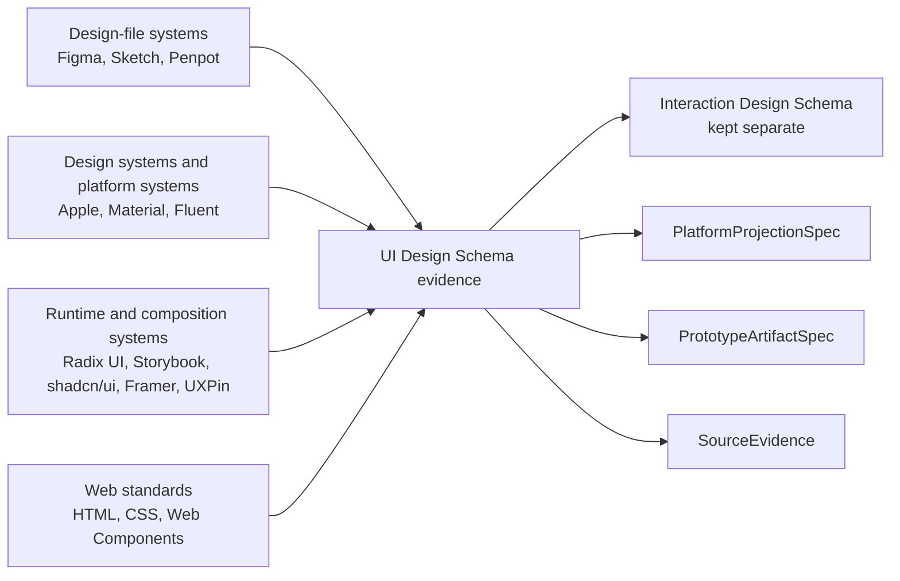

# Reference Study for a Future UI Design Schema

## Executive Summary

This report treats **UI Design Schema** as the visual and structural layer of product expression, distinct from an **Interaction Design Schema** that would own behavior facts, flows, and state transitions. Across the surveyed systems, the most stable and reusable schema donors are not any single tool’s whole model, but a recurring set of abstractions: **document/project containers; UI surfaces such as pages, boards, frames, and artboards; hierarchical nodes/layers; reusable component definitions and instances; visual variants and theme modes; layout primitives; style and token references; asset resources; and documentation or handoff artifacts**. Figma, Sketch, and Penpot are the strongest direct donors for authoring-file object models; Apple, Material, Fluent, and the web platform are the strongest donors for platform primitives and public-facing component semantics; Storybook, Radix UI, shadcn/ui, Framer, and UXPin are especially useful for understanding how visual state, props, slots, documentation, and implementation bindings are exposed in practice. citeturn4view6turn4view0turn11view0turn20view1turn23search1turn27search14turn29search0turn33search15turn32search2turn31search1turn34search1turn40search16

A second strong finding is that mature UI systems separate concerns more than they first appear to. Design-file tools expose **visual structure plus some prototype metadata**, but their durable public APIs center on nodes, geometry, fills, effects, layout, component properties, variables, exports, and references rather than complete product behavior. Runtime component systems expose **DOM parts, props, slots, data attributes, themes, and accessibility affordances**, but not necessarily authoring-file hierarchy. Documentation systems expose **examples, controls, props tables, and story artifacts**, which are valuable as observable projections of the UI layer rather than as the authoritative model itself. This strongly supports a future local architecture in which **UI Design Schema**, **Interaction Design Schema**, **PlatformProjectionSpec**, **PrototypeArtifactSpec**, and **SourceEvidence** remain separate. citeturn3search4turn7view2turn11view6turn33search15turn33search7turn32search3turn32search4turn39search1turn40search10

A third finding is about evidence quality. For schema work, the most reliable authorities are: **official REST or plugin APIs**, **official file-format documentation**, **official runtime component documentation**, **public design-system docs**, and **open-source code where the system itself is open**. Figma’s REST and plugin docs are much stronger schema authority than any reverse-engineered `.fig` content; Sketch’s official ZIP+JSON file-format docs are unusually useful; Penpot’s open-source data model and export format are especially valuable because they expose not just user-facing concepts but internal conceptual entities such as files, pages, components, and shapes. By contrast, Framer and UXPin provide useful runtime and integration evidence, but their internal project serialization is comparatively opaque in public documentation. citeturn4view6turn4view0turn11view0turn20view1turn20view2turn34search10turn40search16

The diagram above is a synthesis of the evidence gathered in this report: each family contributes different parts of a future UI Design Schema, and no one family should be allowed to dominate the final model. citeturn4view6turn11view0turn20view1turn23search1turn27search14turn29search0turn33search15turn41search2

## Method and Evidence Lens

The evidence standard used here is deliberately conservative. **Confirmed** means the fact is stated in official public docs, APIs, file-format docs, or open-source source maintained by the system owner. **Confirmed by artifact** means it is stated in official sample/export docs or directly observable in official runtime or export artifacts. **Inferred** means it follows from official docs or from the documented behavior of the product, but is not itself named as an explicit schema contract. **Unknown or private** means the system likely has additional internal structure that is not publicly documented and should not be copied into a local schema merely because it exists. This matters because your project is aiming at an LLM-readable, durable schema, not a clone of any vendor’s internal serialization. citeturn4view6turn11view0turn20view2turn20view3turn34search10turn40search10

A practical consequence is that **artifact observability** varies sharply by system. Figma publicly exposes a JSON file tree over REST and a large plugin object model, but not a public `.fig` serialization contract. Sketch officially documents its ZIP archive and JSON structure. Penpot goes further: it documents both the conceptual data model and an export/import format built on ZIP, readable JSON, and assets, with legacy binary forms explicitly called out as deprecated. Web Components, HTML, and Shadow DOM are standards-based and therefore unusually stable schema references for slots, custom elements, and encapsulated subtree boundaries. citeturn4view6turn3search4turn11view0turn20view2turn20view1turn41search1turn41search0turn41search18

The analysis lens in the rest of this report is therefore: **surface model**, **node/layer model**, **component model**, **variant and visual-state model**, **layout model**, **style/token model**, **asset/resource model**, **platform mapping**, **documentation and handoff**, **implementation binding**, and **what should explicitly not be absorbed**. That lens maps closely to a future UI Design Schema while intentionally leaving product behavior, business rules, and interaction state machines to a separate Interaction Design Schema. This separation is reinforced by the surveyed systems themselves: the public shape of their UI-layer APIs and docs is much more stable than their behavior modeling conventions. citeturn4view0turn7view2turn11view6turn18view6turn33search22turn34search1turn40search0

## System Briefs

**Figma.** Figma is primarily a **design-file system with public API observability** and strong component, variable, and layout models. Official REST docs expose files as JSON with top-level metadata plus a `document` node, component maps, component sets, styles, and branches; the node catalog covers `DOCUMENT`, `CANVAS`, `FRAME`, `SECTION`, vectors, text, components, component sets, and instances. Frames are first-class layout containers with auto layout, grid mode, wrapping, sizing modes (`FIXED`, `HUG`, `FILL`), padding, item spacing, constraints, layout grids, overflow direction, effects, masks, and style references. Components expose `componentPropertyDefinitions`; instances expose `componentId`, `componentProperties`, exposed instances, and direct `overrides`. Variables are organized in collections and modes, with `valuesByMode`, published and subscribed IDs, aliasing, and `boundVariables` references appearing on file nodes and property types. Mature workflow: pages and sections organize surfaces, frames stand in for screens and regions, components and component sets define reusable UI, auto layout drives responsive structure, and variables/styles provide visual reuse; handoff is strengthened by REST JSON, plugin APIs, component mappings, annotations, and export/image endpoints. Confirmed: node tree, layout fields, component properties, variable collections and modes; inferred: how teams map sections and flows to product screens; unknown/private: native `.fig` serialization and internal editor-only metadata. Useful donors: file/page/node/component/property/variable/layout/effect/export models. Do not absorb: Figma-specific IDs, editor artifacts, or prototype behavior fields as the base UI Design Schema. citeturn4view6turn4view0turn7view5turn8view0turn7view3turn7view0turn7view2turn4view2turn4view4turn4view1turn6view0turn4view5

**Sketch.** Sketch remains a major **static design-file and reusable-component reference** because its file format is unusually observable. Official docs state that Sketch documents are ZIP archives containing JSON plus binary assets; `meta.json` stores document metadata and `document.json` stores common data such as shared styles and page references. The official API exposes `Document`, `Page`, top-level frames/artboards, `SymbolMaster`, `SymbolInstance`, `SharedStyle`, libraries, swatches, and overrides, including text, symbol, image, color, visibility, and sizing overrides. Sketch’s mature workflow centers on Symbols, Text Styles, Layer Styles, Color Variables, Components View organization, Libraries for cross-document reuse, and export presets. Current docs also show Stack Layout frames, resizing constraints, frames as UI containers, grid features, and prototype constructs like links, overlays, scroll areas, and custom layer visibility. Confirmed: ZIP+JSON format, document/page/symbol/shared-style/library API, color variables exported as color tokens/CSS variables/JSON, library synchronization, overlays and scrolling in prototypes; inferred: how far Smart Layout/Stack Layout can stand in for a general semantic layout schema; unknown/private: editor internals beyond the public file schema and JS API. Useful donors: package/document/page/artboard/layer/symbol/override/shared-style/library/export models. Do not absorb: Sketch naming conventions such as special “Symbols” pages, legacy prototype fields as primary behavior schema, or any assumption that an artboard-based canvas is the universal UI surface abstraction. citeturn11view0turn14view0turn14view2turn14view3turn15view0turn15view3turn15view4turn11view5turn11view4turn11view2turn11view6turn16search2turn16search5turn16search1turn16search12

**Penpot.** Penpot is a particularly important reference because it combines **design-file authoring, design-system features, and open-source data model visibility**. Official docs define layers as boards, shapes, texts, paths, and graphics; boards are high-level containers that can nest, clip content, serve as screens in view mode, and connect in prototyping. Penpot design systems include assets, libraries, components, variants, and design tokens. Components have a main component plus copies/instances; libraries can be local to a file or shared across files in a team. Penpot’s Design Tokens feature explicitly states adherence to the W3C DTCG draft format and supports token creation, aliases, math expressions, themes/sets, and JSON import/export. Flex Layout is documented as being built over CSS Flexbox and exposes direction, alignment, justify, gap, padding, margin, and sizing. The technical guide documents a conceptual data model with teams, projects, files, pages, components, libraries, and shapes; pages and components both contain shape trees. Export/import docs describe a ZIP-based readable format with JSON plus assets and explicitly mark the old binary `.penpot` format as deprecated. Confirmed: board/layer/component/variant/library/token/flex/data-model/export concepts; inferred: exact runtime parity between conceptual model and all storage/API surfaces; unknown/private: parts of SaaS-specific operational metadata outside the conceptual model. Useful donors: open container/tree/shape/component/token/export/source-evidence models. Do not absorb: Penpot-specific exporter metadata details as universal schema fields, or SVG-shaped internals that exist only to preserve round-tripping. citeturn18view1turn18view2turn18view3turn18view4turn18view5turn18view6turn20view0turn20view1turn20view2turn20view3turn18view7turn21view0

**Apple Design Resources and Apple HIG.** Apple is not primarily a design-file system; it is a **platform-native UI expression reference**. Apple Design Resources publishes official UI kits and templates for iOS, iPadOS, macOS, watchOS, and visionOS in Figma and Sketch, along with app icon templates, product bezels, typography resources, and SF Symbols downloads. The current resources page states that SF Symbols 7 includes more than 6,900 symbols in nine weights and three scales, aligned with San Francisco. HIG pages define canonical platform primitives such as sidebars, tab bars, sheets, popovers, layout, color, and accessibility guidance, while SwiftUI docs expose safe-area controls such as `ignoresSafeArea` and `safeAreaInset`. For a future UI Design Schema, Apple contributes strong evidence for **platform containers, safe-area semantics, navigation and presentation primitives, symbol assets, typography and color systems, and platform-specific surface contexts**. Confirmed: official UI kits and templates, SF Symbols properties, HIG surface primitives, safe-area APIs; inferred: how far HIG visual guidance should be decomposed into neutral schema entities rather than platform-specific projections; unknown/private: internal resource file structures of Apple-provided design kits. Do not absorb: Apple brand styling as a universal baseline, or platform-specific control taxonomies as the only canonical component vocabulary. citeturn23search1turn24search26turn23search8turn23search4turn23search0turn24search15turn23search9turn24search7turn24search0turn24search16turn24search12

**Material Design, Material 3, and Material Web.** Material is a **design-system and component reference with strong tokenization and adaptive-layout guidance**. Official Material 3 docs describe Material as an adaptable system of guidelines, components, and tools backed by open-source code, and position Material 3 around personal, adaptive, and expressive experiences. The design-token docs say tokens are the building blocks of UI elements and that the same tokens are used across design, tools, and code. Style docs explicitly cover color roles, typography, shape, spacing, icons, and motion, while adaptive-design docs define adaptive design, layout terminology, and breakpoint-driven transitions from single-pane to two- or three-pane layouts. Material Web adds runtime observability: official component docs for buttons, checkboxes, dialogs, FABs, menus, selects, switches, and text fields show component-level tokens mapped to system tokens and exposed as CSS custom properties. Confirmed: token hierarchy, adaptive design language, style foundations, and web-component token surfaces; inferred: how much of Material’s Android-first platform naming should enter a neutral schema; unknown/private: internal Google design-file packaging beyond public docs. Useful donors: semantic token layering, component token inheritance, adaptive layout concepts, and public component theming contracts. Do not absorb: Material’s brand language or exact token names as the local schema’s canonical names. citeturn27search14turn27search3turn27search9turn27search23turn27search0turn27search2turn27search13turn27search20turn27search5turn27search26turn27search21turn27search15turn27search6turn28search0turn28search4turn28search2turn28search6turn28search8turn28search10turn28search18turn28search14

**Fluent UI and Fluent 2.** Fluent is a **design-system and component reference with unusually explicit token layering and strong accessibility intent**. Official Fluent 2 docs define design tokens as stored values for color, typography, spacing, and elevation and describe two token layers: global tokens for raw values and alias tokens for semantic meaning. Fluent’s Figma design-language file is described as the source of truth for color, stroke width, corner radius, spacing, and size tokens, with variables supporting mode, theme, and brand toggling. On the implementation side, Microsoft’s Fluent UI Web Components docs describe standards-based web components built on FAST, registered through a `DesignSystem`, customizable via design tokens, and flexible across frameworks. Styling docs also call out extensive use of design tokens and an adaptive color system. Confirmed: token hierarchy, design-file variable workflow, web-component registration and token usage, React component surface; inferred: exact cross-platform parity between Fluent design tokens and all native Windows/XAML expressions; unknown/private: proprietary design artifact details not exposed in public kits. Useful donors: alias/global token layering, accessibility-forward component docs, and design-to-runtime token continuity. Do not absorb: Microsoft-specific naming or desktop-platform assumptions as universal schema structure. citeturn29search0turn29search6turn29search5turn29search10turn29search14turn29search15turn29search1turn29search4

**Tailwind CSS.** Tailwind is not a component system; it is a **utility grammar and theme-variable surface over CSS primitives**. Official docs now describe theme variables as CSS variables defined with `@theme` that determine which utility classes exist, including custom colors and breakpoints. Responsive design is configured through breakpoint theme variables; dark mode is a first-class variant; state variants like `hover`, `focus`, and `disabled` can be stacked with breakpoints and dark mode; flex, wrapping, grid template columns, and overflow utilities all map straightforwardly onto layout primitives. Tailwind is therefore valuable less as a final schema model and more as a **compact, proven grammar for expressing layout, spacing, sizing, typography, color, and stateful style-selection logic**. Confirmed: theme variables, breakpoint customization, dark mode, stacked state variants, flex/grid/overflow utilities; inferred: whether utility-level naming should map directly to a future schema; unknown/private: none in a file-format sense, because Tailwind is code-first and publicly documented. Useful donors: separable token families, responsive qualifier patterns, and normalized layout/value vocabularies. Do not absorb: class strings themselves as the schema, or Tailwind’s terseness as a human/LLM readability requirement. citeturn30search0turn30search6turn30search5turn30search2turn30search1turn30search4turn30search12turn30search21turn30search11

**shadcn/ui.** shadcn/ui is best understood as a **code distribution and composition system**, not as a packaged component library. Its official docs explicitly say “This is not a component library. It is how you build your component library.” The CLI initializes project config, dependencies, utility helpers, and CSS variables; `components.json` documents theming choices and recommends semantic CSS variables such as `background`, `foreground`, and `primary`; theming docs show the CSS-variable route as the default; registry docs describe a system for distributing components, hooks, pages, config, rules, and other files; and registry item examples show schema-like package metadata including dependencies, files, and CSS variables. Confirmed: distribution model, registry concept, CLI initialization, theme variable usage; inferred: long-term stability of any particular registry item schema; unknown/private: none central, because the value is in public conventions. Useful donors: portable component-package metadata, semantic theme token naming, and the separation between **component source distribution** and **runtime dependency packages**. Do not absorb: framework-specific generated file layouts, or the assumption that copy-into-project distribution is the only valid handoff mode. citeturn31search1turn31search14turn31search4turn31search0turn31search5turn31search10turn31search11turn31search18

**Radix UI.** Radix Primitives are a highly valuable **unstyled accessible primitive system**. Official docs emphasize that the primitives are unstyled, pass `className` through to DOM elements, and expose state via `data-state` attributes for styling. The composition guide shows the `asChild` pattern, where Radix clones child elements or custom components to attach behavior while leaving element choice and styling to the consumer. Component docs show clear multi-part anatomy—e.g., `Dialog.Root`, `Dialog.Trigger`, `Dialog.Portal`, `Dialog.Overlay`, `Dialog.Content`, `Dialog.Title`, `Dialog.Description`, `Dialog.Close`—and document controlled/uncontrolled modes, focus management, keyboard handling, scroll areas, and menu/tab structures. Confirmed: parts-based anatomy, `data-state` exposure, `asChild` composition, accessibility behavior, scroll container modeling; inferred: how far Radix parts should map to local schema “slots” versus “parts”; unknown/private: no hidden file model because the system is runtime-focused. Useful donors: part/slot decomposition, DOM-agnostic composition, accessible visual-state exposure, and a clean split between structure and styling. Do not absorb: React-specific implementation expectations such as `forwardRef` as schema-level requirements. citeturn32search2turn32search3turn32search4turn32search1turn32search5turn32search6turn32search0

**Storybook.** Storybook is a **documentation and runtime preview artifact system for components and states**. Official docs define it as a frontend workshop for building UI components and pages in isolation. The Component Story Format is explicitly described as an open standard based on ES modules; stories are objects describing how to render components; multiple stories can exist per component and build on each other; `args` provide live-editable props, slots, styles, and inputs; `argTypes` can be inferred or manually declared; Controls give a graphical UI for changing arguments; decorators wrap stories with extra rendering context; Autodocs turn stories into living documentation; tags control inclusion in docs and tests. Confirmed: stories, CSF, args, argTypes, controls, decorators, autodocs, tags; inferred: which story metadata fields are stable enough to treat as long-lived schema inputs outside Storybook; unknown/private: none in the core story format, but addon ecosystems vary. Useful donors: documentation artifacts, variant/example packaging, props tables, live-preview projections, and source-evidence links from code to visual exemplars. Do not absorb: Storybook-specific build or addon architecture as the core UI Design Schema. citeturn39search4turn33search15turn33search5turn33search22turn33search1turn33search7turn33search4turn33search10turn33search2turn33search19

**Framer.** Framer is a **web visual/runtime system** rather than a classic design-file schema authority. Official dev docs frame code components as custom React components with visual controls, auto-sizing, and shareable URLs; Property Controls expose props in the Framer UI; Code Overrides modify layer or component properties at preview/published runtime; and the Code File API manages code files that export either overrides or code components. Help docs show breakpoint-aware layout grids, responsive layout templates, shared components across workspace projects, built-in icon sets, and conditional or trigger-driven switching of component variants. Framer therefore contributes strongest evidence around **visual runtime projection, editable component props, previewable breakpoints, component libraries, image optimization, and published artifact behavior**. Confirmed: property controls, code components, overrides, code-file APIs, breakpoint/grid/template behavior, shared components, icon sets, image optimization; inferred: internal page/frame/component serialization, which is not fully public; unknown/private: Framer’s full project-file schema. Useful donors: published-artifact projections, prop-control exposure, runtime preview context, and breakpoint-aware layout views. Do not absorb: override code patterns or CMS/interaction features as the core visual schema. citeturn34search9turn34search6turn34search1turn34search10turn34search12turn34search0turn35search13turn35search17turn36search0turn36search20turn35search20

**UXPin.** UXPin spans **authoring, prototyping, and code-backed design-system integration**, with especially strong evidence wherever Merge is involved. Official UXPin docs present Components, States, Variables, Interactions, Grid, and styling surfaces in the editor; States allow one element to have multiple property sets such as default, hover, active, and disabled; Variables are global across pages; and Merge imports React components from Git repositories, Storybook, or npm, keeping them in sync with the editor. Merge Component Manager and Merge Design System Documentation add observable metadata layers for component properties, descriptions, categories, versions, and generated documentation. Confirmed: component/state/variable/interactions features, grid types, Merge Git and Storybook integration, documentation generation, per-project version control; inferred: exact local artifact model for UXPin prototypes outside the visible editor docs; unknown/private: full internal project serialization. Useful donors: code-backed component bindings, explicit component metadata/documentation surfaces, and the idea that a design system library can be versioned independently from individual prototypes. Do not absorb: UXPin’s richer behavior logic into the UI Design Schema, except where it surfaces visual states or component property metadata. citeturn39search1turn40search2turn40search0turn40search3turn40search6turn40search21turn40search16turn40search1turn40search4turn40search7turn40search10turn40search14

**Web Components, HTML, and Shadow DOM.** The web platform provides the most durable **open-spec reference for slots, custom elements, encapsulation boundaries, and host/child composition**. WHATWG HTML states that custom elements let authors build fully featured DOM elements and inform the parser how to construct them; MDN’s Web Components overview describes the suite as custom elements, Shadow DOM, and templates/slots; `attachShadow()` attaches a shadow tree and returns a `ShadowRoot`; the `<slot>` element is a placeholder inside a web component filled by external markup; named slots are assigned through the slot name mechanism; `::slotted()` styles slotted elements; and `customElements` exposes the global registry. Confirmed: custom element, shadow tree, slot, slotted styling, registry, and declarative shadow-root-related attributes; inferred: which of these mechanisms should appear in a generic UI Design Schema versus staying in a PlatformProjectionSpec for web; unknown/private: none, because this is open specification territory. Useful donors: slot semantics, host-versus-internals separation, part projection logic, and formal notions of document/root/element. Do not absorb: raw browser API surface area or JavaScript lifecycle details that belong in platform/runtime layers rather than the neutral schema. citeturn41search1turn41search2turn41search18turn41search6turn41search0turn41search13turn41search10turn41search16turn41search9

**Design Tokens Community Group.** In this pass, the DTCG itself is only **partially covered directly**; however, its influence is explicit in multiple official systems. Penpot states that its design tokens adhere to the Design Tokens Format Module draft by the W3C DTCG, and Microsoft’s Fluent Web Components docs explicitly encourage readers to consult the DTCG when discussing design tokens. That is enough to confirm that the DTCG is the current cross-tool reference point for token semantics, but not enough here to fully inventory its latest draft object model without a direct reading of the draft itself. The safe present conclusion is that a future UI Design Schema should expect **typed tokens, aliasing/reference chains, semantic layering, and transportable token payloads**, while treating exact DTCG field names and module stability as evidence still to be collected directly. citeturn18view6turn29search2

**CSS and HTML layout primitives.** Direct CSSWG specs were not exhaustively reviewed in this pass, but the surveyed systems repeatedly converge on the same primitives: **document and root trees, flex-like linear layout, grid layout, overflow/scroll containers, padding/gaps/alignment, sizing modes, and responsive breakpoints**. Tailwind exposes these through utility classes and theme variables; Penpot explicitly says its Flex Layout is based on Flexbox; and Framer’s breakpoint grids show similar concepts in an editor-facing form. This is sufficient to conclude that a future UI Design Schema should model these concepts semantically rather than adopting any one framework’s syntax. It is not sufficient, in this pass, to claim a complete normative mapping to CSS specifications for every edge case such as intrinsic sizing or container queries. citeturn41search9turn20view0turn30search1turn30search12turn30search21turn30search6turn34search0

## Cross-System Comparison

The table below is a synthesis. Ratings are qualitative and indicate how useful each system is as a donor for a future UI Design Schema, based on the evidence cited in the rightmost column.

| System | Design-file observability | Component model | Variant/state model | Layout model | Token/variable model | Asset/resource model | Evidence |
|---|---|---:|---:|---:|---:|---:|---|
| Figma | High | High | High | High | High | High | REST file JSON, node catalog, variables API, plugin node properties. citeturn4view6turn4view0turn7view0turn4view1turn6view0 |
| Sketch | High | High | Medium | Medium-High | Medium | High | Official ZIP+JSON file docs, Symbols, overrides, libraries, color variables, stacks. citeturn11view0turn15view3turn14view5turn11view4turn16search2 |
| Penpot | High | High | High | High | High | High | Open-source data model, components/variants/tokens, flex layout, ZIP+JSON export. citeturn20view1turn18view3turn18view4turn18view6turn20view0turn20view2 |
| Apple resources/HIG | Low as file schema, High as platform mapping | High as platform primitives | Medium | High | Medium | High | Official kits, symbols, HIG primitives, safe-area APIs. citeturn23search1turn24search26turn23search4turn24search0 |
| Material 3 / Material Web | Medium | High | Medium-High | High | High | Medium | Official tokens, adaptive design, Material Web component tokens. citeturn27search23turn27search6turn28search0turn28search4turn28search8 |
| Fluent UI / Fluent 2 | Medium | High | Medium | Medium | High | Medium | Global+alias tokens, Figma design language, React/Web Component docs. citeturn29search0turn29search6turn29search5turn29search1 |
| Tailwind CSS | Low | Low | High for style selection | High | High | Low | Theme variables, responsive/dark/state variants, layout utilities. citeturn30search0turn30search2turn30search6turn30search12 |
| shadcn/ui | Low | Medium-High | Medium | Medium | Medium-High | Low | Code distribution model, semantic CSS vars, registry metadata. citeturn31search1turn31search4turn31search5turn31search10 |
| Radix UI | None as file schema | High | High | Medium | Low | Low | Parts, `asChild`, `data-state`, dialog/tabs/scroll primitives. citeturn32search2turn32search3turn32search4turn32search6 |
| Storybook | None as file schema | Medium | High as documented examples | Low | Low | Medium as docs assets | CSF, args, argTypes, controls, decorators, autodocs. citeturn33search15turn33search22turn33search1turn33search7turn33search10 |
| Framer | Low | High | High | High | Medium | High | Property controls, code components, breakpoints, grids, assets optimization. citeturn34search1turn34search6turn34search10turn34search0turn35search20 |
| UXPin | Low-Medium | High | High | Medium | Medium | Medium | Components, states, variables, Merge Git/Storybook, docs generation. citeturn40search2turn40search0turn40search3turn40search16turn40search10 |
| Web Components / HTML | High as open spec | High for host/slot model | Medium | Medium | Low | Low | Custom elements, shadow DOM, slots, registry. citeturn41search1turn41search18turn41search0turn41search16 |
| DTCG | Medium in this pass | N/A | N/A | N/A | High as reference target | N/A | Indirectly confirmed as the token standard target by Penpot and Fluent docs. citeturn18view6turn29search2 |

A second comparison, focused on suitability for a future local schema, is below.

| System | Platform-native mapping | Documentation/handoff | Implementation binding | Open-source / open-spec strength | Suitability for LLM-readable UI Design Schema |
|---|---:|---:|---:|---:|---:|
| Figma | Medium | High | Medium-High | Medium | Very high |
| Sketch | Medium | Medium-High | Medium | Medium | High |
| Penpot | Medium | Medium | Medium | Very high | Very high |
| Apple resources/HIG | Very high | High | High for Apple platforms | Medium | High, but mainly via PlatformProjectionSpec |
| Material 3 / Material Web | High | High | High | High | Very high |
| Fluent UI / Fluent 2 | High | High | High | High | High |
| Tailwind CSS | Low | Medium | High | High | High as grammar donor, not as object model |
| shadcn/ui | Low | Medium | High | High | Medium-High |
| Radix UI | Medium | Medium | High | High | High for component/part/state structure |
| Storybook | Low | Very high | High | High | High for documentation artifact projection |
| Framer | Medium | Medium | High | Medium | Medium |
| UXPin | Medium | High | Very high | Medium | High for code-backed component linkage |
| Web Components / HTML | High on web | Medium | Very high | Very high | Very high for slots/host/encapsulation |
| DTCG | N/A | N/A | High in principle | High | High, but needs direct draft review |

These comparative ratings are not popularity judgments; they reflect how directly each system contributes stable schema abstractions under the evidence gathered in this report. citeturn4view6turn11view0turn20view1turn23search1turn27search23turn29search0turn30search0turn31search1turn32search2turn33search15turn34search1turn40search16turn41search1

## Schema-Relevant Takeaways

The recurring **surface model** is stronger than any one tool-specific term. Figma uses `CANVAS`, `FRAME`, and `SECTION`; Sketch uses pages, top-level frames/artboards, and templates; Penpot uses pages and boards; Apple HIG speaks in views, sidebars, tab bars, sheets, and popovers; Storybook speaks in stories and pages as documentation artifacts; Framer and UXPin expose pages, breakpoints, and preview contexts. A future UI Design Schema should therefore almost certainly distinguish at least: **document/project scope**, **surface containers**, **nested regions or groups**, and **preview/context surfaces**. It should not force every system through one “screen/artboard” assumption. citeturn4view0turn7view3turn14view2turn16search5turn18view1turn23search4turn24search26turn33search5turn35search10turn40search5

The recurring **node/layer model** is also stable: nearly every system has hierarchical nodes with geometry, visibility, locking or read-only state, clipping/masks, style references, and export-related metadata. Figma’s node docs make this explicit; Sketch’s file and JS docs expose layers, artboards, styles, and export formats; Penpot describes shapes as the core design layers, rendered to SVG with extra metadata for Penpot-specific properties; Framer and UXPin expose layers and visual properties in their editors. This suggests a future UI Design Schema should prefer a **typed-node tree with shared base properties and per-type extensions**, rather than a flat list of elements. citeturn8view0turn11view0turn20view1turn20view3turn34search12turn40search17

The recurring **component model** has striking convergence even where naming differs. Figma has components, component sets, instances, component properties, and overrides; Sketch has Symbol sources, Symbol instances, overrides, and library references; Penpot has main components and copies plus variants; Radix decomposes components into structured parts and composition points; Storybook exposes stories, args, and argTypes; UXPin Merge binds code components with exposed props; Framer code components expose property controls. Across all of these, the most reusable schema concepts are: **component definition**, **component instance**, **exposed property surface**, **part/slot/child insertion points**, **local overrides**, **library or package linkage**, and **documentation/runtime projections**. citeturn7view0turn7view2turn15view3turn14view5turn18view3turn18view4turn32search3turn33search22turn34search1turn40search16

The recurring **variant and visual-state model** is where systems most often blur into interaction. The stable schema lesson is to keep only the **visual side** in UI Design Schema: things like variant axes, theme modes, size variants, visual hover/pressed/disabled/error/loading presentations, visibility toggles, breakpoint-specific variants, or `data-state`-style state surfaces. Figma’s component properties and variable modes, Sketch’s overrides and stateful symbols, Penpot variants, Radix `data-state`, Storybook story variants, UXPin states, and Framer triggers/variants all support this. What should stay out is behavioral causality itself unless the system only exposes a visual selector hook. citeturn4view2turn4view1turn16search1turn18view4turn32search2turn33search5turn40search0turn36search0

The recurring **layout model** is perhaps the most schema-ready area. Figma exposes auto layout, wrapping, grid, constraints, overflow, padding, spacing, and sizing modes; Sketch exposes frames, stack layout, resizing constraints, and grids; Penpot explicitly maps Flex Layout to CSS Flexbox; Tailwind offers a compact grammar over flex, grid, overflow, and responsive breakpoints; Framer exposes breakpoint grids and responsive templates; Apple and Material contribute safe areas and adaptive layout guidance. The strongest schema implication is that layout should be modeled semantically and composably, with distinct concepts for **container strategy**, **child positioning rules**, **alignment**, **spacing/padding**, **sizing behavior**, **overflow/scrolling**, and **responsive context**. citeturn7view5turn8view0turn16search2turn16search12turn20view0turn30search1turn30search12turn30search21turn34search0turn35search13turn24search0turn27search16

The recurring **style/token/resource model** is likewise strong, but with an important distinction between raw values and semantic aliases. Fluent explicitly documents global and alias tokens; Material documents a hierarchy from component tokens to system tokens; Figma variables use collections, modes, aliases, and `boundVariables`; Sketch Color Variables can be exported to tokens, CSS variables, and JSON; Penpot tokens support aliases and equations and align themselves to DTCG; Tailwind theme variables produce utility surfaces; shadcn/ui recommends semantic CSS variables. This implies a future UI Design Schema should likely carry **raw value tokens**, **semantic tokens**, **alias/reference links**, **theme or mode scopes**, and **bindings from tokens to concrete node/component properties** as distinct concepts rather than flattening everything into literal style values. citeturn29search0turn28search0turn4view1turn6view0turn11view4turn18view6turn30search0turn31search4

## Research Gaps and Recommended Next Evidence

The most important gap is a **direct review of the current DTCG draft modules themselves**. This report confirmed DTCG influence indirectly through Penpot and Fluent documentation, but a schema project of this scope should read the latest draft directly before any token schema decisions are made. Until that happens, any detailed token-object recommendations beyond typed tokens, aliases, and themes should be treated as provisional. citeturn18view6turn29search2

A second gap is **direct normative CSS layout evidence**. This report intentionally leaned on official product docs and highly visible web-platform summaries, but did not fully inventory CSSWG specifications for flexbox, grid, intrinsic sizing, box alignment, overflow, containment, or container queries. Because layout is one of the strongest donor areas for a future UI Design Schema, those standards should be reviewed next and compared against Figma, Sketch, Penpot, Tailwind, Framer, and Apple/Material adaptive guidance. citeturn20view0turn30search12turn30search21turn34search0turn24search15turn27search16

A third gap is **optional secondary references** that would likely improve the token and documentation portions of the research: Style Dictionary, Tokens Studio, Zeroheight, and—primarily for historical comparison only—Adobe XD. They were in scope as optional references but were not directly researched in this pass, so they should not be used yet as evidence for schema decisions. Their likely value is clear: Style Dictionary for transforms and platform outputs, Tokens Studio for design-token authoring workflows inside design tools, and Zeroheight for documentation/handoff artifact structure. No stronger claim should be made here without direct source collection.

A fourth gap is **artifact-level reverse engineering where official docs are thin**. The strongest candidates are exported Framer and UXPin artifacts, plus deeper comparison of Sketch and Penpot exports against their official conceptual models. Figma file internals should only be reverse-engineered with caution, because the official public schema authority remains Figma’s REST and plugin documentation rather than any unofficial `.fig` decoder. citeturn4view6turn11view0turn20view2turn34search10turn40search16

A practical next-evidence checklist for the project is therefore: direct DTCG draft review; direct CSSWG layout pass; direct review of Style Dictionary and Tokens Studio official docs; collection of a small corpus of official/exported artifacts from Sketch and Penpot and, where publicly obtainable, Framer/UXPin; and finally a evidence-led mapping exercise that traces each candidate UI Design Schema concept back to at least one **confirmed source of truth** and clearly labels anything still inferred or unknown. That next step should still avoid designing the final schema, but it will materially reduce ambiguity before JSON Schema authoring begins.